# Comprehensive Results — GNN Activation-Based Pruning

Generated from `results/<method>/summary.csv`. Five methods compared across every completed (dataset, architecture) cell at 9 sparsity levels (0.1–0.9). Each cell shows the per-sparsity table (best method per row **bold**) and the overlaid accuracy-vs-sparsity plot from `results/wanda-per-class/plots/`, which draws all four pruning methods plus the dense reference.

## Methods

- **No-Pruning** — dense baseline (0% sparsity).
- **Magnitude** — prune lowest `|W|` per layer (CGP-style baseline).
- **Wanda-Uniform** — prune lowest `|W|·‖X‖₂` (activation-aware).
- **Wanda-Degree** — Wanda with degree-weighted activations (`√deg·X`).
- **Wanda-Per-Class** — Wanda with class-balanced activation norms (the proposal's hypothesis).

## Metric note

Heterophilic datasets (Cornell/Texas/Wisconsin/Actor) report **macro-F1**, the metric aligned with the class-imbalance hypothesis; these are 5-class, imbalanced graphs, so macro-F1 sits well below accuracy (e.g. Wisconsin/GPR-GNN ≈ 0.59 macro-F1 ≈ 0.77 accuracy). Multi-label Yelp reports **micro-F1**; everything else reports **accuracy**. All numbers are single-seed except the heterophilic cells, which are averaged over the 10 Geom-GCN splits.

## Coverage

31 of 33 (dataset, architecture) cells completed across all 5 methods. **Not shown:** `reddit/gat` (full-batch attention OOM, ~178 GiB — infeasible on any GPU) and `ogbn-products/graphsage` (OGB interactive-download prompt in the headless run — recoverable). Reddit is covered by GCN and GraphSAGE.

## Headline finding (win counts: times each method is best, across cells × sparsities)

| Group | Magnitude | Wanda-Uniform | Wanda-Degree | Wanda-Per-Class |
|---|---|---|---|---|
| **All cells** | 109 | 91 | 51 | 28 |
| Heterophilic (GPR-GNN) | 6 | 13 | 12 | 5 |
| Homophilic small/medium | 60 | 25 | 15 | 8 |
| Homophilic large | 15 | 13 | 11 | 6 |
| Graph classification | 13 | 19 | 0 | 4 |

> **Wanda-Per-Class is the weakest method by win count in every group**, including the heterophilic/class-imbalanced regime it was hypothesized to help. With a functional heterophilic backbone (GPR-GNN), the simpler activation-aware variants (Uniform/Degree) lead; plain Magnitude is strongest overall. We find no evidence that class- or topology-aware refinements to activation pruning help.

## Dense baselines (0% sparsity), all cells

| Dataset | Architecture | Metric | Dense value | Runs |
|---|---|---|---|---|
| cornell | GPRGNN | macro-F1 | 0.486 | 10 |
| texas | GPRGNN | macro-F1 | 0.557 | 10 |
| wisconsin | GPRGNN | macro-F1 | 0.590 | 10 |
| actor | GPRGNN | macro-F1 | 0.312 | 10 |
| cornell | GCN | macro-F1 | 0.242 | 10 |
| cornell | GAT | macro-F1 | 0.303 | 10 |
| texas | GCN | macro-F1 | 0.249 | 10 |
| wisconsin | GCN | macro-F1 | 0.309 | 10 |
| actor | GCN | macro-F1 | 0.242 | 10 |
| actor | GAT | macro-F1 | 0.227 | 10 |
| cora | GCN | accuracy | 0.805 | 1 |
| cora | GAT | accuracy | 0.800 | 1 |
| citeseer | GCN | accuracy | 0.703 | 1 |
| citeseer | GAT | accuracy | 0.678 | 1 |
| pubmed | GCN | accuracy | 0.782 | 1 |
| pubmed | GAT | accuracy | 0.765 | 1 |
| cs | GCN | accuracy | 0.938 | 1 |
| physics | GCN | accuracy | 0.966 | 1 |
| photo | GCN | accuracy | 0.939 | 1 |
| photo | GAT | accuracy | 0.902 | 1 |
| computers | GCN | accuracy | 0.905 | 1 |
| computers | GAT | accuracy | 0.900 | 1 |
| ogbn-arxiv | GRAPHSAGE | accuracy | 0.548 | 1 |
| flickr | GRAPHSAGE | accuracy | 0.448 | 1 |
| reddit | GCN | accuracy | 0.565 | 1 |
| reddit | GRAPHSAGE | accuracy | 0.479 | 1 |
| yelp | GRAPHSAGE | micro-F1 | 0.296 | 1 |
| bbbp | GCN | accuracy | 0.800 | 1 |
| bbbp | GRAPHSAGE | accuracy | 0.780 | 1 |
| proteins | GCN | accuracy | 0.652 | 1 |
| proteins | GRAPHSAGE | accuracy | 0.643 | 1 |

---

## 1. Heterophilic — GPR-GNN backbone *(primary heterophilic result)*

The proposal's hypothesis lives here: class-imbalanced, heterophilic graphs. Vanilla GCN/GAT cannot learn these (Section 2), so we re-ran them with **GPR-GNN**, a heterophily-capable backbone whose prunable weights are still plain Linears. GPR-GNN roughly doubles vanilla GCN's macro-F1 (e.g. Wisconsin 0.59 vs 0.31), so the pruning comparison is finally interpretable — and Per-Class still does not win.

_Win counts here:_ Magnitude: **6**  ·  Wanda-Uniform: **13**  ·  Wanda-Degree: **12**  ·  Wanda-Per-Class: **5**  (of 36)

#### cornell · GPRGNN

*Metric: macro-F1 · dense baseline (0% sparsity): **0.486** · averaged over 10 runs*

| Sparsity | Magnitude | Wanda-Uniform | Wanda-Degree | Wanda-Per-Class |
|---|---|---|---|---|
| 0.1 | 0.486 | **0.489** | 0.475 | **0.489** |
| 0.2 | 0.486 | **0.489** | 0.475 | **0.489** |
| 0.3 | **0.489** | 0.489 | 0.475 | 0.489 |
| 0.4 | **0.492** | 0.489 | 0.475 | 0.489 |
| 0.5 | **0.507** | 0.492 | 0.480 | 0.492 |
| 0.6 | 0.493 | **0.495** | 0.492 | 0.495 |
| 0.7 | 0.505 | 0.478 | **0.527** | 0.510 |
| 0.8 | **0.525** | 0.508 | 0.490 | 0.518 |
| 0.9 | 0.461 | **0.466** | 0.381 | 0.460 |

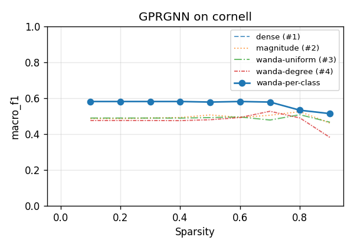

#### texas · GPRGNN

*Metric: macro-F1 · dense baseline (0% sparsity): **0.557** · averaged over 10 runs*

| Sparsity | Magnitude | Wanda-Uniform | Wanda-Degree | Wanda-Per-Class |
|---|---|---|---|---|
| 0.1 | 0.557 | 0.552 | **0.569** | 0.552 |
| 0.2 | 0.557 | 0.552 | **0.569** | 0.552 |
| 0.3 | 0.557 | 0.557 | **0.569** | 0.552 |
| 0.4 | 0.551 | 0.552 | **0.568** | 0.552 |
| 0.5 | 0.551 | 0.559 | **0.566** | 0.554 |
| 0.6 | 0.546 | 0.553 | **0.563** | 0.553 |
| 0.7 | 0.549 | 0.564 | 0.552 | **0.571** |
| 0.8 | 0.549 | 0.541 | 0.512 | **0.562** |
| 0.9 | 0.460 | **0.491** | 0.323 | 0.483 |

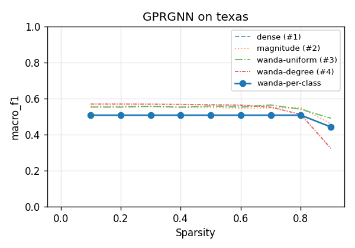

#### wisconsin · GPRGNN

*Metric: macro-F1 · dense baseline (0% sparsity): **0.590** · averaged over 10 runs*

| Sparsity | Magnitude | Wanda-Uniform | Wanda-Degree | Wanda-Per-Class |
|---|---|---|---|---|
| 0.1 | 0.590 | 0.593 | **0.594** | 0.593 |
| 0.2 | 0.588 | 0.593 | **0.594** | 0.593 |
| 0.3 | 0.587 | 0.593 | **0.594** | 0.593 |
| 0.4 | 0.586 | 0.593 | **0.594** | 0.593 |
| 0.5 | **0.599** | 0.592 | 0.594 | 0.578 |
| 0.6 | 0.604 | 0.599 | **0.606** | 0.597 |
| 0.7 | 0.591 | **0.628** | 0.621 | 0.595 |
| 0.8 | 0.596 | **0.605** | 0.574 | 0.585 |
| 0.9 | 0.544 | **0.556** | 0.489 | 0.539 |

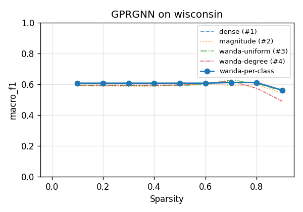

#### actor · GPRGNN

*Metric: macro-F1 · dense baseline (0% sparsity): **0.312** · averaged over 10 runs*

| Sparsity | Magnitude | Wanda-Uniform | Wanda-Degree | Wanda-Per-Class |
|---|---|---|---|---|
| 0.1 | 0.312 | 0.312 | 0.312 | **0.312** |
| 0.2 | 0.312 | **0.313** | 0.313 | 0.312 |
| 0.3 | 0.310 | 0.312 | 0.313 | **0.314** |
| 0.4 | 0.314 | 0.313 | 0.313 | **0.316** |
| 0.5 | 0.315 | **0.315** | 0.315 | 0.314 |
| 0.6 | **0.314** | 0.312 | 0.311 | 0.311 |
| 0.7 | 0.304 | **0.306** | 0.305 | 0.303 |
| 0.8 | 0.289 | **0.295** | 0.294 | 0.281 |
| 0.9 | 0.214 | **0.240** | 0.237 | 0.191 |

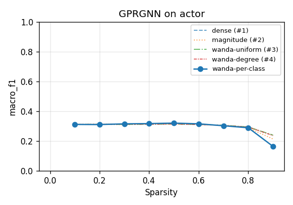

---

## 2. Heterophilic — vanilla GCN/GAT *(base model fails to learn — uninterpretable)*

Included for completeness. On these the dense models barely clear trivial baselines (macro-F1 0.23–0.31; near or below majority-class accuracy), so method differences are noise. This is the known heterophily failure of homophily-assuming aggregation, and the reason Section 1 re-runs them with GPR-GNN.

_Win counts here:_ Magnitude: **15**  ·  Wanda-Uniform: **21**  ·  Wanda-Degree: **13**  ·  Wanda-Per-Class: **5**  (of 54)

#### cornell · GCN

*Metric: macro-F1 · dense baseline (0% sparsity): **0.242** · averaged over 10 runs*

| Sparsity | Magnitude | Wanda-Uniform | Wanda-Degree | Wanda-Per-Class |
|---|---|---|---|---|
| 0.1 | 0.238 | **0.244** | 0.242 | **0.244** |
| 0.2 | 0.233 | **0.244** | 0.242 | **0.244** |
| 0.3 | 0.234 | **0.244** | 0.242 | **0.244** |
| 0.4 | 0.235 | 0.244 | **0.244** | 0.244 |
| 0.5 | 0.232 | 0.241 | **0.244** | 0.243 |
| 0.6 | 0.226 | 0.241 | **0.243** | 0.240 |
| 0.7 | 0.235 | 0.238 | **0.243** | 0.243 |
| 0.8 | **0.265** | 0.236 | 0.252 | 0.243 |
| 0.9 | 0.207 | **0.226** | 0.223 | 0.216 |

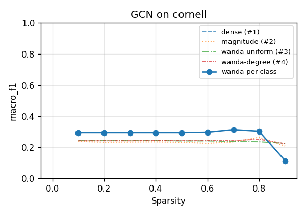

#### cornell · GAT

*Metric: macro-F1 · dense baseline (0% sparsity): **0.303** · averaged over 10 runs*

| Sparsity | Magnitude | Wanda-Uniform | Wanda-Degree | Wanda-Per-Class |
|---|---|---|---|---|
| 0.1 | **0.303** | 0.301 | 0.292 | 0.299 |
| 0.2 | **0.303** | 0.298 | 0.297 | 0.298 |
| 0.3 | **0.301** | 0.297 | 0.296 | 0.297 |
| 0.4 | **0.305** | 0.299 | 0.300 | 0.300 |
| 0.5 | 0.307 | **0.316** | 0.299 | 0.298 |
| 0.6 | 0.320 | 0.328 | 0.318 | **0.330** |
| 0.7 | **0.343** | 0.341 | 0.333 | 0.324 |
| 0.8 | **0.347** | 0.336 | 0.312 | 0.319 |
| 0.9 | **0.335** | 0.301 | 0.229 | 0.271 |

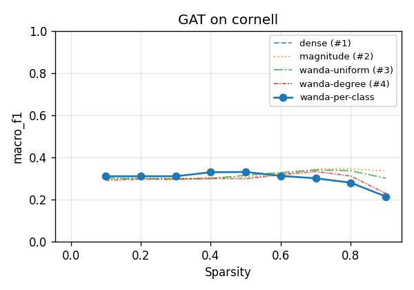

#### texas · GCN

*Metric: macro-F1 · dense baseline (0% sparsity): **0.249** · averaged over 10 runs*

| Sparsity | Magnitude | Wanda-Uniform | Wanda-Degree | Wanda-Per-Class |
|---|---|---|---|---|
| 0.1 | 0.250 | 0.259 | **0.261** | 0.259 |
| 0.2 | 0.248 | 0.259 | **0.261** | 0.259 |
| 0.3 | 0.242 | 0.259 | **0.261** | 0.259 |
| 0.4 | 0.249 | 0.258 | **0.261** | 0.259 |
| 0.5 | 0.246 | 0.259 | **0.261** | 0.259 |
| 0.6 | 0.241 | **0.262** | 0.256 | 0.262 |
| 0.7 | 0.255 | **0.257** | 0.251 | 0.256 |
| 0.8 | 0.244 | 0.259 | 0.234 | **0.273** |
| 0.9 | 0.205 | **0.268** | 0.201 | 0.246 |

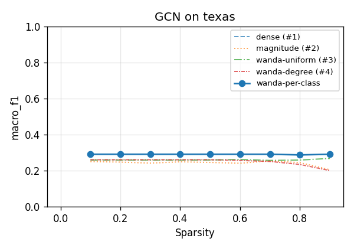

#### wisconsin · GCN

*Metric: macro-F1 · dense baseline (0% sparsity): **0.309** · averaged over 10 runs*

| Sparsity | Magnitude | Wanda-Uniform | Wanda-Degree | Wanda-Per-Class |
|---|---|---|---|---|
| 0.1 | 0.310 | **0.314** | 0.311 | **0.314** |
| 0.2 | 0.309 | **0.314** | 0.311 | **0.314** |
| 0.3 | 0.305 | **0.314** | 0.311 | **0.314** |
| 0.4 | 0.311 | **0.314** | 0.311 | 0.313 |
| 0.5 | **0.318** | 0.306 | 0.308 | 0.301 |
| 0.6 | 0.309 | **0.315** | 0.311 | 0.308 |
| 0.7 | **0.311** | 0.308 | 0.311 | 0.310 |
| 0.8 | 0.301 | **0.308** | 0.291 | 0.289 |
| 0.9 | 0.246 | 0.272 | **0.281** | 0.270 |

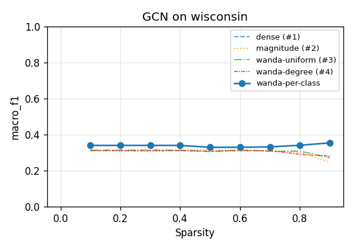

#### actor · GCN

*Metric: macro-F1 · dense baseline (0% sparsity): **0.242** · averaged over 10 runs*

| Sparsity | Magnitude | Wanda-Uniform | Wanda-Degree | Wanda-Per-Class |
|---|---|---|---|---|
| 0.1 | 0.242 | 0.242 | **0.243** | 0.243 |
| 0.2 | 0.242 | **0.242** | 0.242 | 0.242 |
| 0.3 | 0.242 | **0.244** | 0.243 | 0.244 |
| 0.4 | **0.240** | 0.239 | 0.239 | 0.239 |
| 0.5 | 0.235 | 0.234 | **0.237** | 0.235 |
| 0.6 | 0.233 | **0.234** | 0.233 | 0.232 |
| 0.7 | 0.215 | **0.226** | 0.221 | 0.219 |
| 0.8 | 0.192 | **0.212** | 0.206 | 0.196 |
| 0.9 | 0.165 | **0.175** | 0.167 | 0.168 |

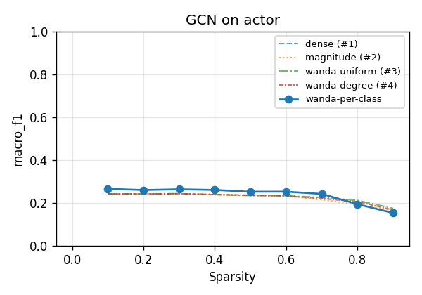

#### actor · GAT

*Metric: macro-F1 · dense baseline (0% sparsity): **0.227** · averaged over 10 runs*

| Sparsity | Magnitude | Wanda-Uniform | Wanda-Degree | Wanda-Per-Class |
|---|---|---|---|---|
| 0.1 | **0.227** | 0.226 | 0.226 | 0.226 |
| 0.2 | 0.226 | 0.226 | **0.228** | 0.227 |
| 0.3 | 0.225 | **0.227** | 0.226 | 0.226 |
| 0.4 | 0.226 | 0.225 | 0.226 | **0.227** |
| 0.5 | 0.226 | 0.226 | 0.226 | **0.226** |
| 0.6 | 0.225 | 0.225 | 0.226 | **0.227** |
| 0.7 | **0.225** | 0.222 | 0.223 | 0.222 |
| 0.8 | **0.221** | 0.217 | 0.215 | 0.217 |
| 0.9 | **0.208** | 0.197 | 0.193 | 0.198 |

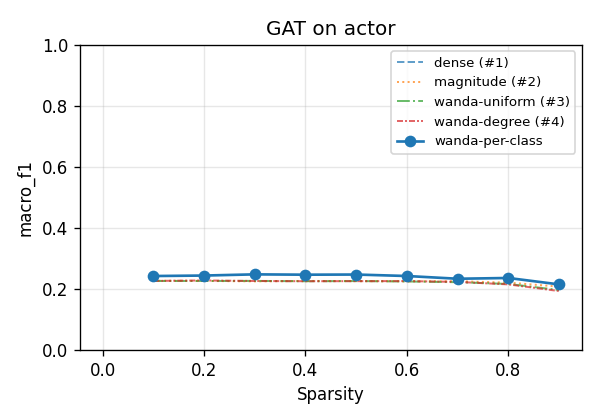

---

## 3. Homophilic — small/medium node classification *(healthy base models)*

Base models are strong (accuracy 0.68–0.97, far above trivial), so this comparison is meaningful. Methods are nearly tied until ~70% sparsity; at extreme sparsity Wanda-Uniform is modestly best and Per-Class is among the weakest.

_Win counts here:_ Magnitude: **60**  ·  Wanda-Uniform: **25**  ·  Wanda-Degree: **15**  ·  Wanda-Per-Class: **8**  (of 108)

#### cora · GCN

*Metric: accuracy · dense baseline (0% sparsity): **0.805** · averaged over 1 run*

| Sparsity | Magnitude | Wanda-Uniform | Wanda-Degree | Wanda-Per-Class |
|---|---|---|---|---|
| 0.1 | **0.803** | **0.803** | **0.803** | **0.803** |
| 0.2 | 0.802 | 0.801 | **0.803** | 0.802 |
| 0.3 | 0.800 | **0.803** | 0.802 | **0.803** |
| 0.4 | **0.804** | 0.799 | 0.798 | **0.804** |
| 0.5 | 0.805 | **0.809** | 0.803 | **0.809** |
| 0.6 | **0.804** | 0.797 | 0.769 | 0.800 |
| 0.7 | 0.787 | 0.787 | 0.757 | **0.791** |
| 0.8 | **0.780** | 0.758 | 0.704 | 0.778 |
| 0.9 | **0.733** | 0.640 | 0.548 | 0.580 |

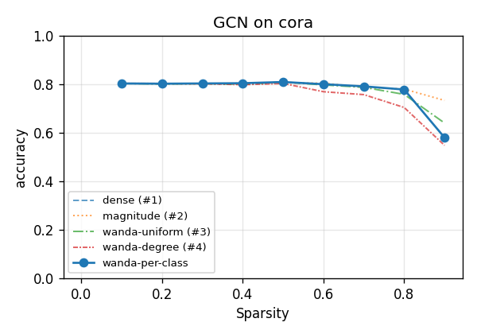

#### cora · GAT

*Metric: accuracy · dense baseline (0% sparsity): **0.800** · averaged over 1 run*

| Sparsity | Magnitude | Wanda-Uniform | Wanda-Degree | Wanda-Per-Class |
|---|---|---|---|---|
| 0.1 | **0.802** | 0.783 | 0.783 | 0.783 |
| 0.2 | **0.801** | 0.784 | 0.784 | 0.784 |
| 0.3 | **0.802** | 0.785 | 0.785 | 0.784 |
| 0.4 | **0.802** | 0.788 | 0.785 | 0.785 |
| 0.5 | **0.800** | 0.783 | 0.786 | 0.783 |
| 0.6 | **0.804** | 0.788 | 0.790 | 0.792 |
| 0.7 | **0.808** | 0.790 | 0.788 | 0.787 |
| 0.8 | **0.804** | 0.790 | 0.793 | 0.785 |
| 0.9 | **0.782** | 0.732 | 0.752 | 0.723 |

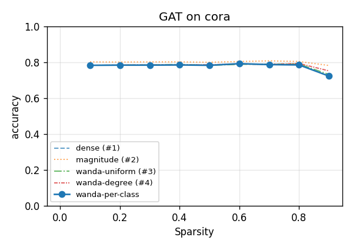

#### citeseer · GCN

*Metric: accuracy · dense baseline (0% sparsity): **0.703** · averaged over 1 run*

| Sparsity | Magnitude | Wanda-Uniform | Wanda-Degree | Wanda-Per-Class |
|---|---|---|---|---|
| 0.1 | **0.703** | 0.690 | 0.690 | 0.691 |
| 0.2 | **0.701** | 0.692 | 0.692 | 0.692 |
| 0.3 | **0.702** | 0.696 | 0.693 | 0.695 |
| 0.4 | **0.701** | 0.685 | 0.687 | 0.688 |
| 0.5 | **0.697** | 0.686 | 0.688 | 0.684 |
| 0.6 | **0.700** | 0.692 | 0.690 | 0.676 |
| 0.7 | 0.680 | **0.683** | 0.678 | 0.675 |
| 0.8 | **0.683** | 0.647 | 0.617 | 0.637 |
| 0.9 | 0.579 | **0.642** | 0.540 | 0.518 |

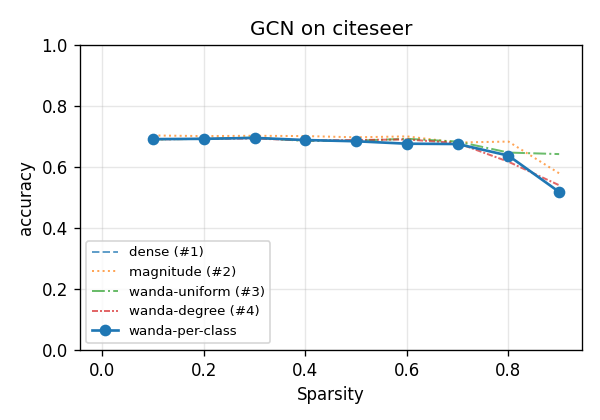

#### citeseer · GAT

*Metric: accuracy · dense baseline (0% sparsity): **0.678** · averaged over 1 run*

| Sparsity | Magnitude | Wanda-Uniform | Wanda-Degree | Wanda-Per-Class |
|---|---|---|---|---|
| 0.1 | 0.678 | 0.694 | 0.694 | **0.695** |
| 0.2 | 0.673 | **0.695** | **0.695** | **0.695** |
| 0.3 | 0.677 | **0.692** | **0.692** | **0.692** |
| 0.4 | 0.677 | 0.692 | **0.694** | 0.693 |
| 0.5 | 0.682 | 0.698 | 0.698 | **0.699** |
| 0.6 | 0.685 | **0.699** | 0.698 | 0.697 |
| 0.7 | 0.688 | **0.699** | 0.696 | 0.697 |
| 0.8 | 0.684 | **0.706** | 0.702 | 0.698 |
| 0.9 | 0.682 | **0.683** | 0.680 | 0.677 |

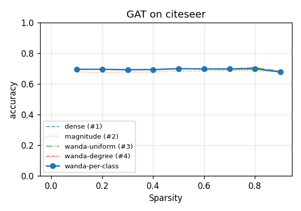

#### pubmed · GCN

*Metric: accuracy · dense baseline (0% sparsity): **0.782** · averaged over 1 run*

| Sparsity | Magnitude | Wanda-Uniform | Wanda-Degree | Wanda-Per-Class |
|---|---|---|---|---|
| 0.1 | **0.782** | 0.781 | 0.780 | 0.781 |
| 0.2 | **0.782** | 0.773 | 0.773 | 0.774 |
| 0.3 | **0.784** | 0.776 | 0.761 | 0.776 |
| 0.4 | 0.783 | **0.785** | 0.745 | 0.783 |
| 0.5 | 0.784 | **0.786** | 0.715 | **0.786** |
| 0.6 | **0.788** | 0.781 | 0.695 | 0.782 |
| 0.7 | **0.788** | 0.756 | 0.634 | 0.764 |
| 0.8 | **0.790** | 0.762 | 0.567 | 0.778 |
| 0.9 | 0.636 | **0.752** | 0.516 | 0.747 |

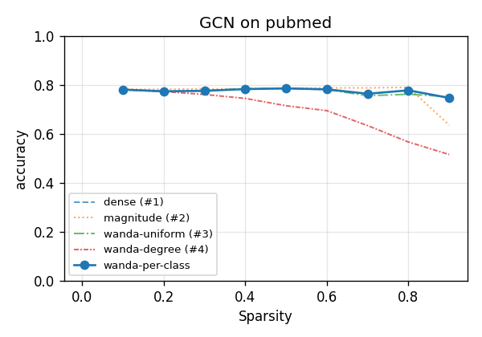

#### pubmed · GAT

*Metric: accuracy · dense baseline (0% sparsity): **0.765** · averaged over 1 run*

| Sparsity | Magnitude | Wanda-Uniform | Wanda-Degree | Wanda-Per-Class |
|---|---|---|---|---|
| 0.1 | **0.765** | 0.760 | 0.760 | 0.760 |
| 0.2 | **0.765** | 0.761 | 0.763 | 0.761 |
| 0.3 | **0.766** | 0.762 | 0.761 | 0.765 |
| 0.4 | **0.765** | 0.759 | 0.754 | 0.757 |
| 0.5 | **0.766** | 0.755 | 0.741 | 0.757 |
| 0.6 | **0.768** | 0.743 | 0.719 | 0.739 |
| 0.7 | **0.761** | 0.725 | 0.692 | 0.719 |
| 0.8 | **0.764** | 0.667 | 0.604 | 0.657 |
| 0.9 | **0.724** | 0.561 | 0.539 | 0.544 |

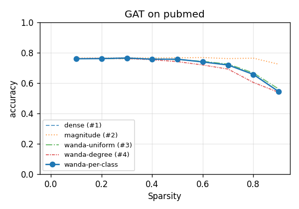

#### cs · GCN

*Metric: accuracy · dense baseline (0% sparsity): **0.938** · averaged over 1 run*

| Sparsity | Magnitude | Wanda-Uniform | Wanda-Degree | Wanda-Per-Class |
|---|---|---|---|---|
| 0.1 | **0.938** | **0.938** | **0.938** | **0.938** |
| 0.2 | **0.939** | 0.938 | 0.938 | 0.938 |
| 0.3 | 0.935 | **0.938** | 0.937 | 0.937 |
| 0.4 | 0.933 | 0.936 | 0.935 | **0.936** |
| 0.5 | 0.929 | **0.935** | 0.935 | **0.935** |
| 0.6 | 0.913 | 0.932 | **0.932** | 0.929 |
| 0.7 | 0.846 | **0.921** | 0.918 | 0.910 |
| 0.8 | 0.591 | 0.903 | **0.908** | 0.823 |
| 0.9 | 0.400 | **0.604** | 0.538 | 0.531 |

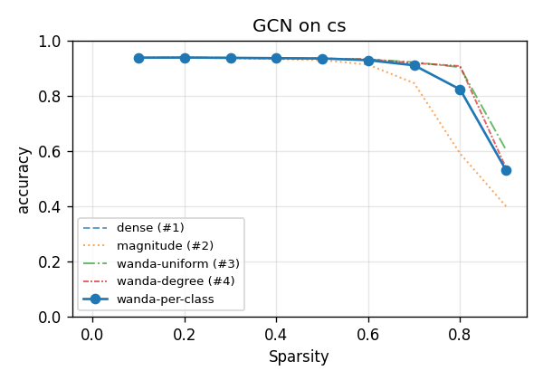

#### physics · GCN

*Metric: accuracy · dense baseline (0% sparsity): **0.966** · averaged over 1 run*

| Sparsity | Magnitude | Wanda-Uniform | Wanda-Degree | Wanda-Per-Class |
|---|---|---|---|---|
| 0.1 | **0.966** | **0.966** | **0.966** | **0.966** |
| 0.2 | **0.966** | 0.966 | **0.966** | **0.966** |
| 0.3 | 0.965 | **0.966** | 0.966 | 0.966 |
| 0.4 | 0.964 | 0.966 | **0.967** | 0.966 |
| 0.5 | 0.960 | **0.966** | **0.966** | 0.965 |
| 0.6 | 0.955 | 0.964 | **0.968** | 0.961 |
| 0.7 | 0.942 | 0.964 | **0.968** | 0.956 |
| 0.8 | 0.935 | 0.964 | **0.965** | 0.938 |
| 0.9 | 0.638 | 0.943 | **0.964** | 0.906 |

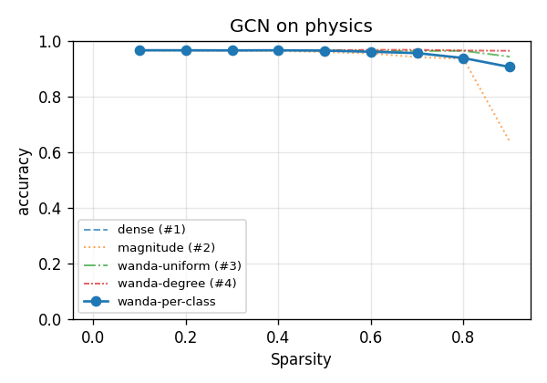

#### photo · GCN

*Metric: accuracy · dense baseline (0% sparsity): **0.939** · averaged over 1 run*

| Sparsity | Magnitude | Wanda-Uniform | Wanda-Degree | Wanda-Per-Class |
|---|---|---|---|---|
| 0.1 | **0.939** | **0.939** | **0.939** | **0.939** |
| 0.2 | **0.939** | **0.939** | **0.939** | **0.939** |
| 0.3 | **0.939** | **0.939** | **0.939** | **0.939** |
| 0.4 | **0.940** | **0.940** | 0.939 | **0.940** |
| 0.5 | **0.941** | 0.939 | 0.939 | 0.939 |
| 0.6 | 0.940 | **0.941** | 0.939 | **0.941** |
| 0.7 | **0.942** | 0.940 | 0.940 | 0.939 |
| 0.8 | **0.941** | 0.938 | 0.938 | 0.938 |
| 0.9 | **0.933** | 0.931 | 0.929 | 0.927 |

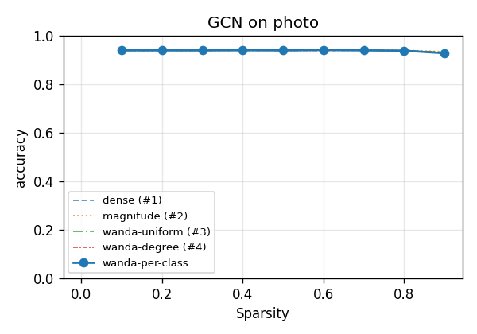

#### photo · GAT

*Metric: accuracy · dense baseline (0% sparsity): **0.902** · averaged over 1 run*

| Sparsity | Magnitude | Wanda-Uniform | Wanda-Degree | Wanda-Per-Class |
|---|---|---|---|---|
| 0.1 | 0.902 | 0.902 | **0.903** | 0.902 |
| 0.2 | 0.902 | **0.903** | 0.903 | **0.903** |
| 0.3 | 0.903 | **0.907** | 0.902 | 0.907 |
| 0.4 | 0.905 | **0.908** | 0.907 | **0.908** |
| 0.5 | 0.892 | 0.901 | **0.902** | 0.901 |
| 0.6 | 0.788 | 0.881 | 0.875 | **0.884** |
| 0.7 | **0.837** | 0.788 | 0.798 | 0.786 |
| 0.8 | **0.865** | 0.531 | 0.545 | 0.575 |
| 0.9 | 0.215 | **0.344** | 0.329 | 0.276 |

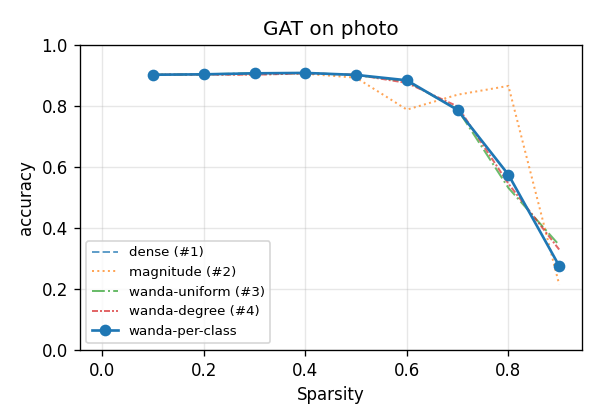

#### computers · GCN

*Metric: accuracy · dense baseline (0% sparsity): **0.905** · averaged over 1 run*

| Sparsity | Magnitude | Wanda-Uniform | Wanda-Degree | Wanda-Per-Class |
|---|---|---|---|---|
| 0.1 | **0.905** | **0.905** | **0.905** | **0.905** |
| 0.2 | **0.905** | **0.905** | **0.905** | **0.905** |
| 0.3 | **0.905** | **0.905** | **0.905** | **0.905** |
| 0.4 | **0.906** | 0.905 | 0.905 | 0.905 |
| 0.5 | **0.906** | **0.906** | 0.906 | **0.906** |
| 0.6 | **0.906** | 0.905 | 0.906 | 0.906 |
| 0.7 | **0.907** | 0.901 | 0.902 | 0.901 |
| 0.8 | 0.897 | 0.900 | 0.900 | **0.901** |
| 0.9 | 0.737 | 0.886 | 0.881 | **0.893** |

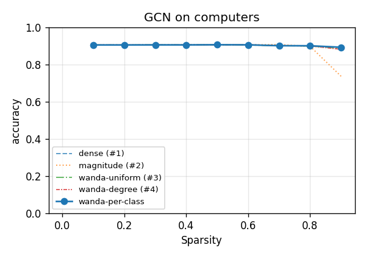

#### computers · GAT

*Metric: accuracy · dense baseline (0% sparsity): **0.900** · averaged over 1 run*

| Sparsity | Magnitude | Wanda-Uniform | Wanda-Degree | Wanda-Per-Class |
|---|---|---|---|---|
| 0.1 | **0.900** | 0.899 | 0.900 | 0.899 |
| 0.2 | **0.901** | 0.899 | 0.900 | 0.899 |
| 0.3 | 0.903 | 0.902 | 0.900 | **0.903** |
| 0.4 | 0.900 | **0.904** | 0.901 | 0.903 |
| 0.5 | 0.889 | 0.897 | **0.904** | 0.898 |
| 0.6 | 0.839 | 0.887 | **0.888** | 0.885 |
| 0.7 | 0.654 | 0.846 | **0.873** | 0.846 |
| 0.8 | 0.638 | 0.723 | **0.802** | 0.667 |
| 0.9 | **0.636** | 0.364 | 0.426 | 0.341 |

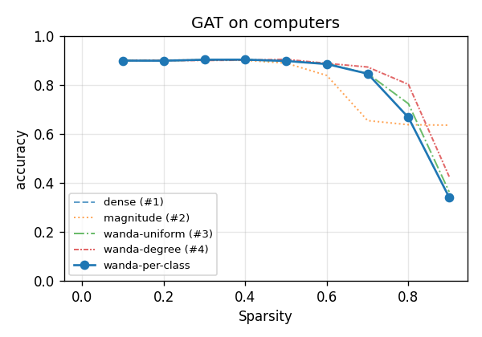

---

## 4. Homophilic — large-scale node classification

Reddit/Yelp/Arxiv/Flickr. Reddit (GCN/SAGE) and Yelp ran via the sparse-adjacency (SpMM) path. Baselines are healthy in rank terms (well above majority) but low in absolute terms vs literature — the 2-layer/100-epoch config is undertuned on these large graphs, and **Flickr is near-trivial** (+0.02 over majority), so treat Flickr as uninterpretable.

_Win counts here:_ Magnitude: **15**  ·  Wanda-Uniform: **13**  ·  Wanda-Degree: **11**  ·  Wanda-Per-Class: **6**  (of 45)

#### ogbn-arxiv · GRAPHSAGE

*Metric: accuracy · dense baseline (0% sparsity): **0.548** · averaged over 1 run*

| Sparsity | Magnitude | Wanda-Uniform | Wanda-Degree | Wanda-Per-Class |
|---|---|---|---|---|
| 0.1 | **0.548** | **0.548** | **0.548** | **0.548** |
| 0.2 | **0.548** | **0.548** | **0.548** | **0.548** |
| 0.3 | **0.548** | 0.548 | 0.548 | 0.548 |
| 0.4 | 0.547 | 0.548 | **0.548** | 0.548 |
| 0.5 | **0.547** | 0.541 | 0.541 | 0.542 |
| 0.6 | 0.531 | 0.536 | **0.540** | 0.535 |
| 0.7 | **0.490** | 0.480 | 0.465 | 0.484 |
| 0.8 | 0.345 | 0.374 | **0.394** | 0.367 |
| 0.9 | 0.055 | 0.097 | **0.202** | 0.095 |

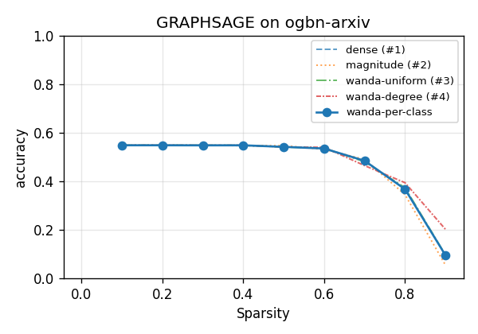

#### flickr · GRAPHSAGE

*Metric: accuracy · dense baseline (0% sparsity): **0.448** · averaged over 1 run*

| Sparsity | Magnitude | Wanda-Uniform | Wanda-Degree | Wanda-Per-Class |
|---|---|---|---|---|
| 0.1 | 0.447 | 0.447 | **0.448** | 0.447 |
| 0.2 | **0.449** | 0.446 | 0.446 | 0.447 |
| 0.3 | **0.446** | 0.445 | 0.445 | 0.444 |
| 0.4 | 0.444 | 0.444 | **0.444** | 0.444 |
| 0.5 | 0.435 | **0.443** | 0.443 | 0.443 |
| 0.6 | 0.439 | 0.440 | 0.440 | **0.440** |
| 0.7 | 0.435 | 0.436 | **0.437** | 0.437 |
| 0.8 | 0.433 | 0.435 | **0.435** | 0.435 |
| 0.9 | 0.424 | **0.432** | 0.431 | 0.431 |

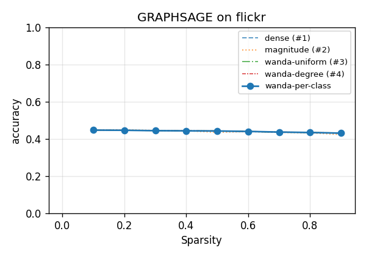

#### reddit · GCN

*Metric: accuracy · dense baseline (0% sparsity): **0.565** · averaged over 1 run*

| Sparsity | Magnitude | Wanda-Uniform | Wanda-Degree | Wanda-Per-Class |
|---|---|---|---|---|
| 0.1 | 0.565 | **0.565** | **0.565** | **0.565** |
| 0.2 | **0.565** | **0.565** | **0.565** | **0.565** |
| 0.3 | **0.566** | 0.565 | 0.565 | 0.565 |
| 0.4 | 0.559 | 0.565 | **0.565** | 0.565 |
| 0.5 | 0.538 | **0.565** | **0.565** | **0.565** |
| 0.6 | 0.510 | **0.565** | **0.565** | **0.565** |
| 0.7 | 0.471 | **0.564** | 0.564 | 0.564 |
| 0.8 | 0.454 | 0.559 | 0.559 | **0.560** |
| 0.9 | 0.344 | 0.466 | 0.440 | **0.470** |

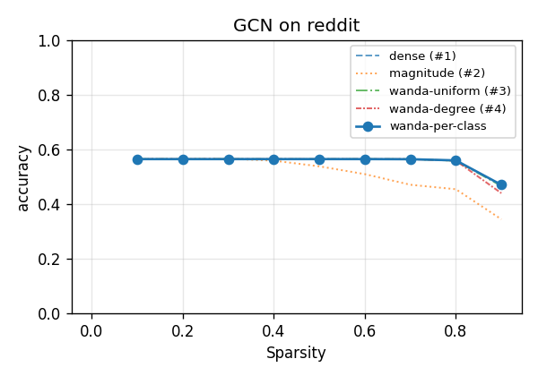

#### reddit · GRAPHSAGE

*Metric: accuracy · dense baseline (0% sparsity): **0.479** · averaged over 1 run*

| Sparsity | Magnitude | Wanda-Uniform | Wanda-Degree | Wanda-Per-Class |
|---|---|---|---|---|
| 0.1 | 0.479 | **0.479** | **0.479** | **0.479** |
| 0.2 | 0.479 | **0.479** | **0.479** | **0.479** |
| 0.3 | **0.488** | 0.479 | 0.479 | 0.479 |
| 0.4 | **0.485** | 0.479 | 0.479 | 0.479 |
| 0.5 | **0.483** | 0.479 | 0.479 | 0.479 |
| 0.6 | **0.480** | 0.479 | 0.479 | 0.479 |
| 0.7 | 0.459 | **0.479** | **0.479** | **0.479** |
| 0.8 | 0.458 | **0.479** | **0.479** | **0.479** |
| 0.9 | 0.452 | **0.479** | **0.479** | **0.479** |

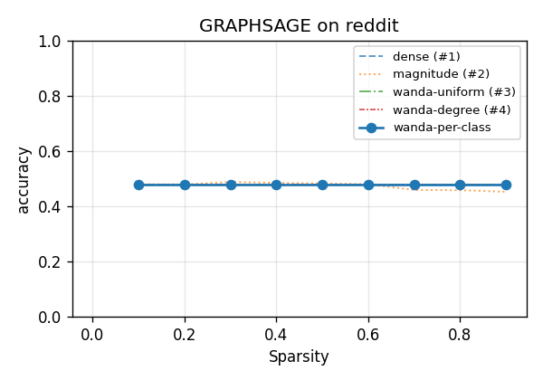

#### yelp · GRAPHSAGE

*Metric: micro-F1 · dense baseline (0% sparsity): **0.296** · averaged over 1 run*

| Sparsity | Magnitude | Wanda-Uniform | Wanda-Degree | Wanda-Per-Class |
|---|---|---|---|---|
| 0.1 | 0.296 | 0.296 | **0.296** | 0.296 |
| 0.2 | **0.297** | 0.296 | 0.296 | 0.296 |
| 0.3 | 0.295 | **0.296** | 0.296 | 0.296 |
| 0.4 | 0.291 | 0.297 | **0.297** | 0.297 |
| 0.5 | **0.301** | 0.297 | 0.298 | 0.297 |
| 0.6 | 0.292 | **0.299** | 0.299 | 0.299 |
| 0.7 | 0.227 | 0.301 | 0.300 | **0.302** |
| 0.8 | 0.226 | 0.299 | 0.298 | **0.299** |
| 0.9 | 0.211 | 0.296 | 0.296 | **0.298** |

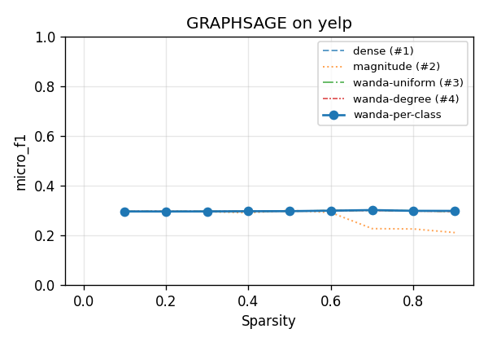

---

## 5. Graph classification

BBBP and PROTEINS (global-mean-pool readout). Single random 80/10/10 split.

_Win counts here:_ Magnitude: **13**  ·  Wanda-Uniform: **19**  ·  Wanda-Degree: **0**  ·  Wanda-Per-Class: **4**  (of 36)

#### bbbp · GCN

*Metric: accuracy · dense baseline (0% sparsity): **0.800** · averaged over 1 run*

| Sparsity | Magnitude | Wanda-Uniform | Wanda-Degree | Wanda-Per-Class |
|---|---|---|---|---|
| 0.1 | **0.805** | 0.800 | 0.800 | 0.800 |
| 0.2 | 0.785 | **0.800** | **0.800** | **0.800** |
| 0.3 | 0.780 | **0.800** | **0.800** | **0.800** |
| 0.4 | 0.785 | **0.805** | **0.805** | **0.805** |
| 0.5 | 0.785 | **0.820** | 0.805 | 0.815 |
| 0.6 | 0.785 | **0.820** | 0.805 | **0.820** |
| 0.7 | 0.785 | **0.790** | 0.693 | **0.790** |
| 0.8 | **0.785** | **0.785** | **0.785** | **0.785** |
| 0.9 | **0.785** | 0.215 | 0.215 | 0.215 |

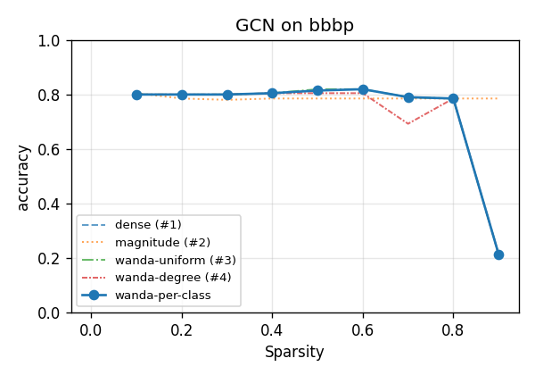

#### bbbp · GRAPHSAGE

*Metric: accuracy · dense baseline (0% sparsity): **0.780** · averaged over 1 run*

| Sparsity | Magnitude | Wanda-Uniform | Wanda-Degree | Wanda-Per-Class |
|---|---|---|---|---|
| 0.1 | 0.766 | **0.780** | **0.780** | **0.780** |
| 0.2 | **0.785** | 0.780 | 0.780 | 0.780 |
| 0.3 | 0.780 | **0.785** | 0.780 | 0.780 |
| 0.4 | 0.771 | **0.790** | 0.785 | 0.785 |
| 0.5 | **0.785** | **0.785** | 0.780 | **0.785** |
| 0.6 | 0.785 | **0.795** | 0.790 | **0.795** |
| 0.7 | 0.785 | 0.795 | 0.415 | **0.805** |
| 0.8 | 0.785 | **0.790** | 0.785 | **0.790** |
| 0.9 | **0.785** | 0.215 | 0.234 | 0.215 |

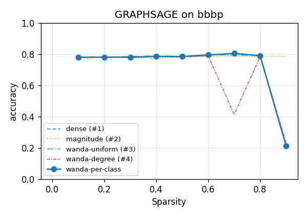

#### proteins · GCN

*Metric: accuracy · dense baseline (0% sparsity): **0.652** · averaged over 1 run*

| Sparsity | Magnitude | Wanda-Uniform | Wanda-Degree | Wanda-Per-Class |
|---|---|---|---|---|
| 0.1 | **0.652** | **0.652** | **0.652** | **0.652** |
| 0.2 | **0.652** | **0.652** | **0.652** | **0.652** |
| 0.3 | **0.652** | **0.652** | **0.652** | **0.652** |
| 0.4 | **0.652** | **0.652** | **0.652** | **0.652** |
| 0.5 | 0.643 | **0.652** | **0.652** | **0.652** |
| 0.6 | 0.625 | **0.670** | 0.661 | 0.661 |
| 0.7 | 0.607 | **0.634** | 0.625 | **0.634** |
| 0.8 | 0.429 | 0.616 | 0.598 | **0.625** |
| 0.9 | 0.571 | **0.598** | **0.598** | **0.598** |

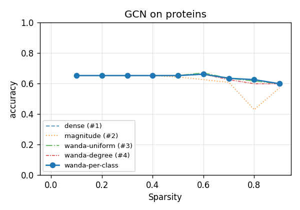

#### proteins · GRAPHSAGE

*Metric: accuracy · dense baseline (0% sparsity): **0.643** · averaged over 1 run*

| Sparsity | Magnitude | Wanda-Uniform | Wanda-Degree | Wanda-Per-Class |
|---|---|---|---|---|
| 0.1 | **0.643** | **0.643** | **0.643** | **0.643** |
| 0.2 | 0.634 | **0.643** | **0.643** | **0.643** |
| 0.3 | **0.643** | **0.643** | **0.643** | **0.643** |
| 0.4 | 0.616 | **0.634** | **0.634** | **0.634** |
| 0.5 | **0.670** | 0.625 | 0.625 | 0.625 |
| 0.6 | 0.607 | 0.607 | 0.607 | **0.616** |
| 0.7 | 0.634 | 0.643 | 0.634 | **0.652** |
| 0.8 | 0.402 | **0.625** | **0.625** | **0.625** |
| 0.9 | 0.402 | **0.598** | **0.598** | **0.598** |

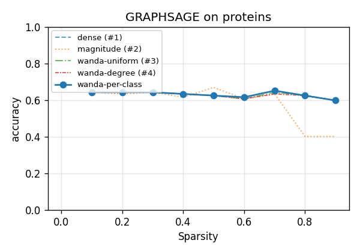
