# Comprehensive Results — GNN Activation-Based Pruning

Generated from `results/<method>/summary.csv`. Five methods compared across every completed (dataset, architecture) cell at 9 sparsity levels (0.1–0.9). Each cell shows the per-sparsity table (best method per row **bold**) and a single overlaid accuracy-vs-sparsity plot (in `results/plots/`) drawing all four pruning methods with ±1 std bands (multi-seed) plus the dense baseline as a reference line.

## Methods

- **No-Pruning** — dense baseline (0% sparsity).
- **Magnitude** — prune lowest `|W|` per layer (CGP-style baseline).
- **Wanda-Uniform** — prune lowest `|W|·‖X‖₂` (activation-aware).
- **Wanda-Degree** — Wanda with degree-weighted activations (`√deg·X`).
- **Wanda-Per-Class** — Wanda with class-balanced activation norms (the proposal's hypothesis).

## Metric note

Heterophilic datasets (Cornell/Texas/Wisconsin/Actor) report **macro-F1**, the metric aligned with the class-imbalance hypothesis; these are 5-class, imbalanced graphs, so macro-F1 sits well below accuracy (e.g. Wisconsin/GPR-GNN ≈ 0.59 macro-F1 ≈ 0.77 accuracy). Multi-label Yelp reports **micro-F1**; everything else reports **accuracy**. All numbers are single-seed except the heterophilic cells, which are averaged over the 10 Geom-GCN splits.

## Coverage

31 of 33 (dataset, architecture) cells completed across all 5 methods. **Not shown:** `reddit/gat` (full-batch attention OOM, ~178 GiB — infeasible on any GPU) and `ogbn-products/graphsage` (OGB interactive-download prompt in the headless run — recoverable). Reddit is covered by GCN and GraphSAGE.

## Headline finding — competitive win counts

For each cell × sparsity level (0.1–0.9), we tally which of the **four pruning methods** is best — **but a win only counts if that method stays competitive with the dense model**, i.e. retains ≥ 95% of the cell's dense-baseline metric (≤ 5% relative drop). A win among collapsed models is not a win. **None-competitive** counts cell × sparsity points where *even the best* pruning method fell below that bar (the over-pruned regime). The dense baseline itself is the reference, not a competitor (it only exists at 0% sparsity).

| Group | Magnitude | Wanda-Uniform | Wanda-Degree | Wanda-Per-Class | None-competitive |
|---|---|---|---|---|---|
| **All cells** | 110 | 67 | 43 | 30 | 29 |
| Heterophilic (GPR-GNN) | 10 | 11 | 9 | 4 | 2 |
| Heterophilic (vanilla GCN/GAT) | 16 | 10 | 15 | 8 | 5 |
| Homophilic small/medium | 46 | 25 | 11 | 11 | 15 |
| Homophilic large | 25 | 9 | 4 | 4 | 3 |
| Graph classification | 13 | 12 | 4 | 3 | 4 |

> **Wanda-Per-Class — the proposal's hypothesized method — is never the best in any group, and ranks last (or tied-last) on every node-classification group.** It provides no benefit even in the heterophilic / class-imbalanced regime it was designed for, now tested on a functional GPR-GNN backbone. Which of the *other* three leads varies by group and is sensitive to the threshold (Magnitude on homophilic and all-cells; Wanda-Uniform on graph-classification and vanilla-heterophilic; the margins are small) — but the **bottom** of the ranking is stable: the class-aware refinement doesn't earn its complexity. The per-class result is robust to the competitiveness bar — last at 90%, 95%, and 99% of dense alike (only the none-competitive total shifts: 12 / 24 / 55 of 279 across all cells).

_Note: "best" is rank at matched sparsity and says nothing about margin — at low sparsity all four methods sit within ~0.3 points, so the per-cell tables below show the actual magnitudes. Per-cell tables bold the row-max (raw best) regardless of competitiveness._

## Dense baselines (0% sparsity), all cells

Homophilic datasets first (alphabetical), then heterophilic (alphabetical).

| Dataset | Homophily | Classes | Architecture | Metric | Dense value | Runs |
|---|---|---|---|---|---|---|
| bbbp | Homophilic (—) | 2 | GCN | accuracy | 0.776 | 3 |
| bbbp | Homophilic (—) | 2 | GRAPHSAGE | accuracy | 0.779 | 3 |
| citeseer | Homophilic (0.74) | 6 | GAT | accuracy | 0.627 | 3 |
| citeseer | Homophilic (0.74) | 6 | GCN | accuracy | 0.700 | 3 |
| computers | Homophilic (0.78) | 10 | GAT | accuracy | 0.906 | 3 |
| computers | Homophilic (0.78) | 10 | GCN | accuracy | 0.904 | 3 |
| cora | Homophilic (0.81) | 7 | GAT | accuracy | 0.802 | 3 |
| cora | Homophilic (0.81) | 7 | GCN | accuracy | 0.809 | 3 |
| cs | Homophilic (0.81) | 15 | GCN | accuracy | 0.941 | 3 |
| flickr | Homophilic (0.32) | 7 | GRAPHSAGE | accuracy | 0.500 | 1 |
| ogbn-arxiv | Homophilic (0.66) | 40 | GRAPHSAGE | accuracy | 0.549 | 1 |
| photo | Homophilic (0.83) | 8 | GAT | accuracy | 0.926 | 3 |
| photo | Homophilic (0.83) | 8 | GCN | accuracy | 0.941 | 3 |
| physics | Homophilic (0.93) | 5 | GCN | accuracy | 0.967 | 3 |
| proteins | Homophilic (—) | 2 | GCN | accuracy | 0.693 | 3 |
| proteins | Homophilic (—) | 2 | GRAPHSAGE | accuracy | 0.667 | 3 |
| pubmed | Homophilic (0.80) | 3 | GAT | accuracy | 0.765 | 3 |
| pubmed | Homophilic (0.80) | 3 | GCN | accuracy | 0.785 | 3 |
| reddit | Homophilic (0.78) | 41 | GCN | accuracy | 0.356 | 1 |
| reddit | Homophilic (0.78) | 41 | GRAPHSAGE | accuracy | 0.535 | 1 |
| yelp | Homophilic (—) | 100\* | GRAPHSAGE | micro-F1 | 0.290 | 1 |
| actor | Heterophilic (0.22) | 5 | GAT | macro-F1 | 0.225 | 30 |
| actor | Heterophilic (0.22) | 5 | GCN | macro-F1 | 0.242 | 30 |
| actor | Heterophilic (0.22) | 5 | GPRGNN | macro-F1 | 0.321 | 30 |
| cornell | Heterophilic (0.13) | 5 | GAT | macro-F1 | 0.285 | 30 |
| cornell | Heterophilic (0.13) | 5 | GCN | macro-F1 | 0.241 | 30 |
| cornell | Heterophilic (0.13) | 5 | GPRGNN | macro-F1 | 0.445 | 30 |
| texas | Heterophilic (0.11) | 5 | GCN | macro-F1 | 0.256 | 30 |
| texas | Heterophilic (0.11) | 5 | GPRGNN | macro-F1 | 0.527 | 30 |
| wisconsin | Heterophilic (0.20) | 5 | GCN | macro-F1 | 0.298 | 30 |
| wisconsin | Heterophilic (0.20) | 5 | GPRGNN | macro-F1 | 0.607 | 30 |

\* Yelp is multi-label (100 binary labels); all other datasets are single-label. Homophily = edge homophily (fraction of edges joining same-label nodes); `—` where undefined (graph-classification, multi-label).

## Best result per (dataset × architecture)

Each cell is the **best metric observed** for that (dataset × architecture) and the regime that produced it: `dense` = no pruning, otherwise `Method @ sparsity`. Same dataset ordering and homophily labels as the table above. **Caveat:** this is the maximum over 37 configurations per cell (dense + 4 methods × 9 sparsities), so it is an optimistic, selection-biased estimate — the per-cell tables further down give the full sparsity curves. `—` = not evaluated (`reddit/gat` OOM; `ogbn-products` download-blocked).

| Dataset | Homophily | GCN | GAT | GraphSAGE | GPR-GNN |
|---|---|---|---|---|---|
| bbbp | Homophilic (—) | 0.782 (Unif @60%) | — | 0.789 (Unif @40%) | — |
| citeseer | Homophilic (0.74) | 0.700 (Mag @10%) | 0.637 (PerCls @10%) | — | — |
| computers | Homophilic (0.78) | 0.905 (Mag @40%) | 0.908 (Mag @30%) | — | — |
| cora | Homophilic (0.81) | 0.811 (Mag @20%) | 0.807 (Mag @70%) | — | — |
| cs | Homophilic (0.81) | 0.941 (Unif @20%) | — | — | — |
| flickr | Homophilic (0.32) | — | — | 0.500 (Mag @40%) | — |
| ogbn-arxiv | Homophilic (0.66) | — | — | 0.551 (Mag @60%) | — |
| photo | Homophilic (0.83) | 0.942 (Mag @50%) | 0.926 (Unif @10%) | — | — |
| physics | Homophilic (0.93) | 0.967 (Unif @20%) | — | — | — |
| proteins | Homophilic (—) | 0.696 (Mag @10%) | — | 0.670 (Mag @50%) | — |
| pubmed | Homophilic (0.80) | 0.785 (dense) | 0.766 (Mag @30%) | — | — |
| reddit | Homophilic (0.78) | 0.362 (Mag @50%) | — | 0.535 (Mag @50%) | — |
| yelp | Homophilic (—) | — | — | 0.290 (dense) | — |
| actor | Heterophilic (0.22) | 0.243 (Unif @10%) | 0.225 (Deg @20%) | — | 0.323 (Unif @60%) |
| cornell | Heterophilic (0.13) | 0.258 (Mag @80%) | 0.310 (Unif @80%) | — | 0.468 (Unif @70%) |
| texas | Heterophilic (0.11) | 0.272 (Deg @10%) | — | — | 0.548 (Deg @10%) |
| wisconsin | Heterophilic (0.20) | 0.306 (Mag @40%) | — | — | 0.623 (Mag @70%) |

---

## 1. Heterophilic — GPR-GNN backbone *(primary heterophilic result)*

The proposal's hypothesis lives here: class-imbalanced, heterophilic graphs. Vanilla GCN/GAT cannot learn these (Section 2), so we re-ran them with **GPR-GNN**, a heterophily-capable backbone whose prunable weights are still plain Linears. GPR-GNN roughly doubles vanilla GCN's macro-F1 (e.g. Wisconsin 0.59 vs 0.31), so the pruning comparison is finally interpretable — and Per-Class still does not win.

_Win counts here:_ Magnitude: **10**  ·  Wanda-Uniform: **11**  ·  Wanda-Degree: **9**  ·  Wanda-Per-Class: **4**  ·  _none-competitive: 2_  (of 36 cell×sparsity points)

#### cornell · GPRGNN

*Metric: macro-F1 · dense baseline (0% sparsity): **0.445** · averaged over 30 runs*

| Sparsity | Magnitude | Wanda-Uniform | Wanda-Degree | Wanda-Per-Class |
|---|---|---|---|---|
| 0.1 | 0.444 | **0.447** | 0.445 | **0.447** |
| 0.2 | 0.444 | **0.447** | 0.445 | **0.447** |
| 0.3 | 0.444 | **0.447** | 0.445 | **0.447** |
| 0.4 | 0.444 | 0.445 | 0.439 | **0.446** |
| 0.5 | **0.454** | 0.446 | 0.438 | 0.447 |
| 0.6 | **0.459** | 0.451 | 0.454 | 0.451 |
| 0.7 | 0.464 | **0.468** | 0.452 | 0.465 |
| 0.8 | 0.461 | 0.455 | 0.406 | **0.465** |
| 0.9 | **0.430** | 0.427 | 0.297 | 0.411 |

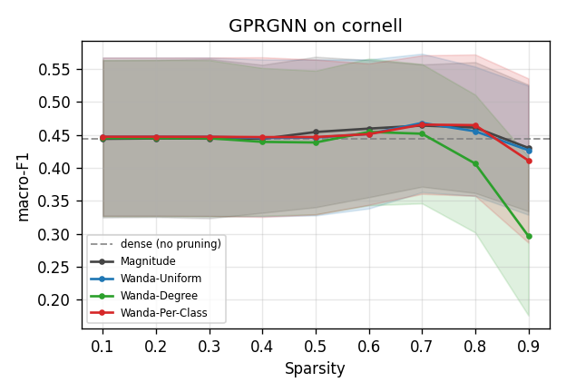

#### texas · GPRGNN

*Metric: macro-F1 · dense baseline (0% sparsity): **0.527** · averaged over 30 runs*

| Sparsity | Magnitude | Wanda-Uniform | Wanda-Degree | Wanda-Per-Class |
|---|---|---|---|---|
| 0.1 | 0.527 | 0.532 | **0.548** | 0.532 |
| 0.2 | 0.528 | 0.532 | **0.548** | 0.532 |
| 0.3 | 0.529 | 0.531 | **0.548** | 0.531 |
| 0.4 | 0.528 | 0.532 | **0.546** | 0.531 |
| 0.5 | 0.528 | 0.525 | **0.544** | 0.534 |
| 0.6 | 0.519 | 0.532 | **0.537** | 0.529 |
| 0.7 | 0.524 | 0.536 | 0.521 | **0.538** |
| 0.8 | 0.515 | **0.531** | 0.487 | 0.527 |
| 0.9 | 0.435 | **0.505** | 0.351 | 0.480 |

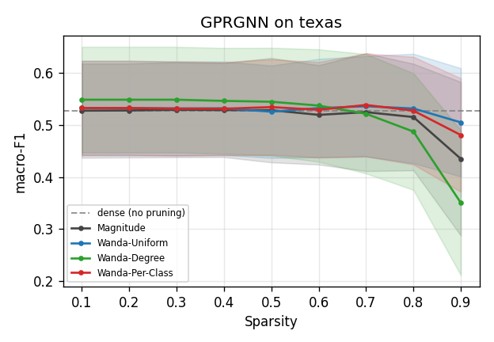

#### wisconsin · GPRGNN

*Metric: macro-F1 · dense baseline (0% sparsity): **0.607** · averaged over 30 runs*

| Sparsity | Magnitude | Wanda-Uniform | Wanda-Degree | Wanda-Per-Class |
|---|---|---|---|---|
| 0.1 | **0.607** | 0.607 | 0.604 | 0.607 |
| 0.2 | 0.607 | **0.607** | 0.604 | **0.607** |
| 0.3 | **0.607** | 0.607 | 0.604 | 0.607 |
| 0.4 | **0.609** | 0.608 | 0.604 | 0.608 |
| 0.5 | **0.619** | 0.606 | 0.606 | 0.608 |
| 0.6 | 0.618 | **0.619** | 0.605 | 0.609 |
| 0.7 | **0.623** | 0.621 | 0.604 | 0.616 |
| 0.8 | **0.621** | 0.619 | 0.569 | 0.615 |
| 0.9 | 0.558 | **0.589** | 0.487 | 0.568 |

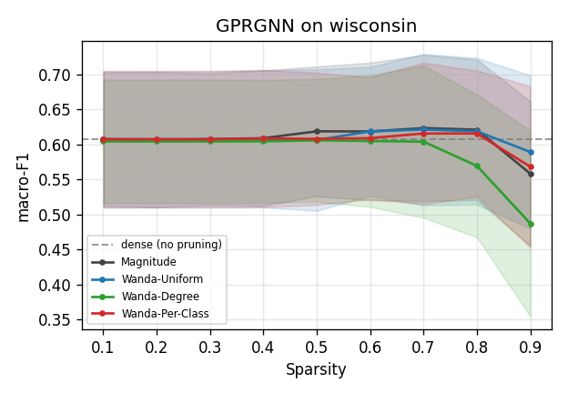

#### actor · GPRGNN

*Metric: macro-F1 · dense baseline (0% sparsity): **0.321** · averaged over 30 runs*

| Sparsity | Magnitude | Wanda-Uniform | Wanda-Degree | Wanda-Per-Class |
|---|---|---|---|---|
| 0.1 | **0.322** | 0.321 | 0.321 | 0.321 |
| 0.2 | 0.321 | 0.322 | **0.322** | 0.322 |
| 0.3 | 0.320 | 0.322 | **0.322** | 0.321 |
| 0.4 | 0.320 | 0.322 | **0.323** | 0.322 |
| 0.5 | 0.317 | 0.322 | 0.321 | **0.323** |
| 0.6 | 0.315 | **0.323** | 0.321 | 0.320 |
| 0.7 | 0.313 | **0.319** | 0.318 | 0.313 |
| 0.8 | 0.296 | **0.304** | 0.301 | 0.288 |
| 0.9 | 0.238 | **0.252** | 0.250 | 0.209 |

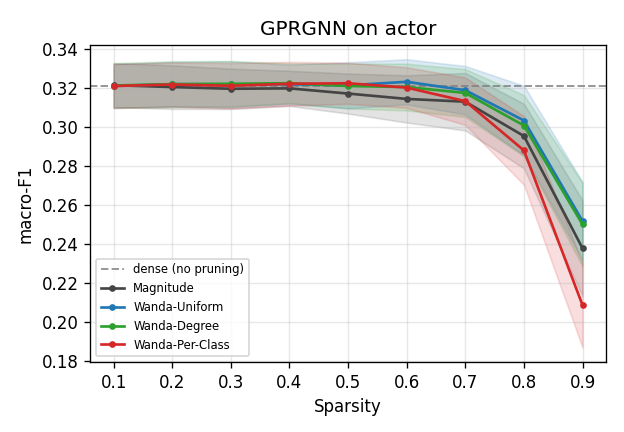

---

## 2. Heterophilic — vanilla GCN/GAT *(base model fails to learn — uninterpretable)*

Included for completeness. On these the dense models barely clear trivial baselines (macro-F1 0.23–0.31; near or below majority-class accuracy), so method differences are noise. This is the known heterophily failure of homophily-assuming aggregation, and the reason Section 1 re-runs them with GPR-GNN.

_Win counts here:_ Magnitude: **16**  ·  Wanda-Uniform: **10**  ·  Wanda-Degree: **15**  ·  Wanda-Per-Class: **8**  ·  _none-competitive: 5_  (of 54 cell×sparsity points)

#### cornell · GCN

*Metric: macro-F1 · dense baseline (0% sparsity): **0.241** · averaged over 30 runs*

| Sparsity | Magnitude | Wanda-Uniform | Wanda-Degree | Wanda-Per-Class |
|---|---|---|---|---|
| 0.1 | 0.239 | 0.248 | **0.249** | 0.248 |
| 0.2 | 0.244 | 0.248 | **0.249** | 0.248 |
| 0.3 | **0.250** | 0.248 | 0.249 | 0.247 |
| 0.4 | **0.254** | 0.246 | 0.249 | 0.248 |
| 0.5 | **0.256** | 0.245 | 0.248 | 0.247 |
| 0.6 | **0.254** | 0.247 | 0.244 | 0.241 |
| 0.7 | **0.258** | 0.248 | 0.255 | 0.254 |
| 0.8 | **0.258** | 0.232 | 0.250 | 0.247 |
| 0.9 | 0.218 | **0.236** | 0.235 | 0.232 |

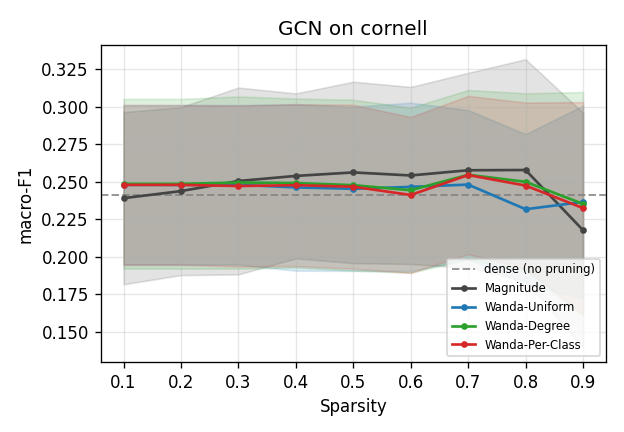

#### cornell · GAT

*Metric: macro-F1 · dense baseline (0% sparsity): **0.285** · averaged over 30 runs*

| Sparsity | Magnitude | Wanda-Uniform | Wanda-Degree | Wanda-Per-Class |
|---|---|---|---|---|
| 0.1 | 0.285 | **0.291** | 0.280 | 0.290 |
| 0.2 | 0.285 | **0.290** | 0.283 | **0.290** |
| 0.3 | 0.285 | **0.293** | 0.281 | 0.292 |
| 0.4 | 0.287 | 0.296 | **0.296** | 0.296 |
| 0.5 | 0.290 | 0.298 | **0.299** | 0.298 |
| 0.6 | 0.296 | 0.294 | 0.297 | **0.297** |
| 0.7 | 0.293 | 0.303 | 0.297 | **0.304** |
| 0.8 | 0.295 | **0.310** | 0.287 | 0.305 |
| 0.9 | 0.280 | **0.287** | 0.234 | 0.273 |

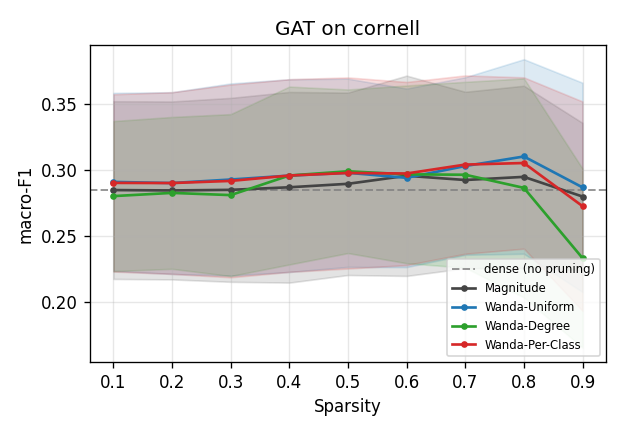

#### texas · GCN

*Metric: macro-F1 · dense baseline (0% sparsity): **0.256** · averaged over 30 runs*

| Sparsity | Magnitude | Wanda-Uniform | Wanda-Degree | Wanda-Per-Class |
|---|---|---|---|---|
| 0.1 | 0.256 | 0.269 | **0.272** | 0.269 |
| 0.2 | 0.254 | 0.269 | **0.272** | 0.269 |
| 0.3 | 0.252 | 0.269 | **0.272** | 0.269 |
| 0.4 | 0.253 | 0.269 | **0.271** | 0.269 |
| 0.5 | 0.255 | 0.270 | **0.271** | 0.270 |
| 0.6 | 0.248 | 0.271 | 0.265 | **0.272** |
| 0.7 | 0.256 | 0.264 | 0.262 | **0.265** |
| 0.8 | 0.235 | 0.258 | 0.244 | **0.264** |
| 0.9 | 0.198 | **0.249** | 0.212 | 0.232 |

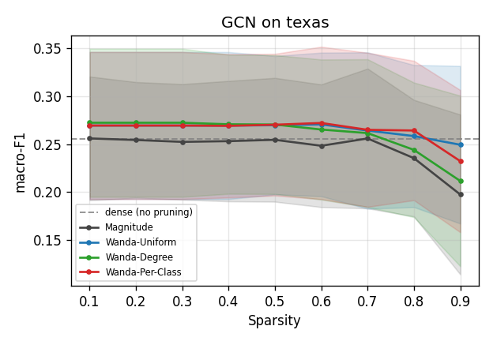

#### wisconsin · GCN

*Metric: macro-F1 · dense baseline (0% sparsity): **0.298** · averaged over 30 runs*

| Sparsity | Magnitude | Wanda-Uniform | Wanda-Degree | Wanda-Per-Class |
|---|---|---|---|---|
| 0.1 | 0.298 | 0.299 | **0.301** | 0.299 |
| 0.2 | 0.298 | 0.299 | **0.301** | 0.299 |
| 0.3 | **0.301** | 0.299 | 0.301 | 0.299 |
| 0.4 | **0.306** | 0.299 | 0.302 | 0.299 |
| 0.5 | **0.304** | 0.297 | 0.300 | 0.296 |
| 0.6 | 0.299 | **0.302** | 0.299 | 0.299 |
| 0.7 | 0.294 | 0.298 | **0.300** | 0.295 |
| 0.8 | 0.293 | **0.295** | 0.292 | 0.290 |
| 0.9 | 0.242 | 0.263 | 0.268 | **0.269** |

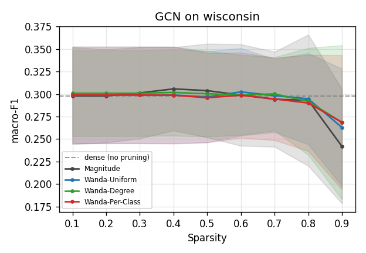

#### actor · GCN

*Metric: macro-F1 · dense baseline (0% sparsity): **0.242** · averaged over 30 runs*

| Sparsity | Magnitude | Wanda-Uniform | Wanda-Degree | Wanda-Per-Class |
|---|---|---|---|---|
| 0.1 | 0.242 | **0.243** | 0.243 | 0.242 |
| 0.2 | **0.242** | 0.242 | 0.241 | 0.241 |
| 0.3 | 0.240 | 0.241 | 0.241 | **0.241** |
| 0.4 | **0.240** | 0.238 | 0.238 | 0.240 |
| 0.5 | **0.237** | 0.235 | 0.233 | 0.235 |
| 0.6 | 0.231 | 0.232 | 0.230 | **0.232** |
| 0.7 | 0.214 | **0.224** | 0.221 | 0.222 |
| 0.8 | 0.185 | **0.208** | 0.205 | 0.206 |
| 0.9 | 0.156 | 0.173 | 0.169 | **0.175** |

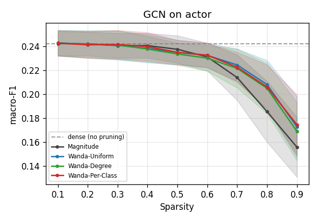

#### actor · GAT

*Metric: macro-F1 · dense baseline (0% sparsity): **0.225** · averaged over 30 runs*

| Sparsity | Magnitude | Wanda-Uniform | Wanda-Degree | Wanda-Per-Class |
|---|---|---|---|---|
| 0.1 | **0.225** | 0.225 | 0.225 | 0.224 |
| 0.2 | 0.224 | 0.224 | **0.225** | 0.224 |
| 0.3 | 0.224 | 0.224 | **0.224** | 0.224 |
| 0.4 | 0.224 | 0.223 | **0.224** | 0.224 |
| 0.5 | 0.223 | 0.223 | 0.223 | **0.223** |
| 0.6 | **0.223** | 0.221 | 0.221 | 0.222 |
| 0.7 | **0.221** | 0.218 | 0.217 | 0.219 |
| 0.8 | **0.215** | 0.210 | 0.209 | 0.211 |
| 0.9 | **0.198** | 0.191 | 0.189 | 0.192 |

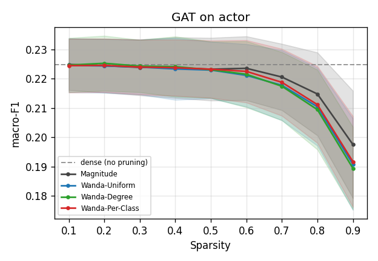

---

## 3. Homophilic — small/medium node classification *(healthy base models)*

Base models are strong (accuracy 0.68–0.97, far above trivial), so this comparison is meaningful. Methods are nearly tied until ~70% sparsity; at extreme sparsity Wanda-Uniform is modestly best and Per-Class is among the weakest.

_Win counts here:_ Magnitude: **46**  ·  Wanda-Uniform: **25**  ·  Wanda-Degree: **11**  ·  Wanda-Per-Class: **11**  ·  _none-competitive: 15_  (of 108 cell×sparsity points)

#### cora · GCN

*Metric: accuracy · dense baseline (0% sparsity): **0.809** · averaged over 3 runs*

| Sparsity | Magnitude | Wanda-Uniform | Wanda-Degree | Wanda-Per-Class |
|---|---|---|---|---|
| 0.1 | 0.808 | **0.808** | **0.808** | **0.808** |
| 0.2 | **0.811** | 0.806 | 0.806 | 0.806 |
| 0.3 | 0.806 | 0.805 | 0.804 | **0.807** |
| 0.4 | **0.807** | 0.798 | 0.795 | 0.801 |
| 0.5 | **0.807** | 0.804 | 0.789 | 0.803 |
| 0.6 | **0.807** | 0.791 | 0.776 | 0.792 |
| 0.7 | **0.797** | 0.785 | 0.761 | 0.785 |
| 0.8 | **0.788** | 0.737 | 0.670 | 0.754 |
| 0.9 | **0.691** | 0.547 | 0.417 | 0.543 |

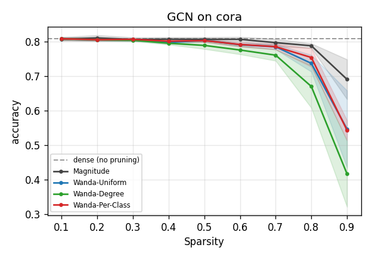

#### cora · GAT

*Metric: accuracy · dense baseline (0% sparsity): **0.802** · averaged over 3 runs*

| Sparsity | Magnitude | Wanda-Uniform | Wanda-Degree | Wanda-Per-Class |
|---|---|---|---|---|
| 0.1 | **0.803** | 0.797 | 0.797 | 0.797 |
| 0.2 | **0.803** | 0.798 | 0.798 | 0.798 |
| 0.3 | **0.803** | 0.798 | 0.798 | 0.798 |
| 0.4 | **0.802** | 0.798 | 0.797 | 0.798 |
| 0.5 | **0.801** | 0.795 | 0.796 | 0.796 |
| 0.6 | **0.803** | 0.796 | 0.797 | 0.797 |
| 0.7 | **0.807** | 0.795 | 0.797 | 0.794 |
| 0.8 | **0.800** | 0.784 | 0.786 | 0.780 |
| 0.9 | **0.773** | 0.728 | 0.727 | 0.709 |

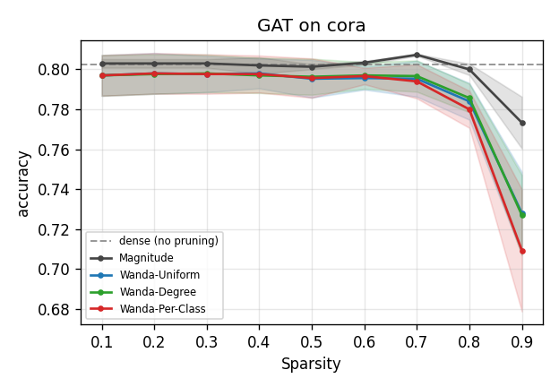

#### citeseer · GCN

*Metric: accuracy · dense baseline (0% sparsity): **0.700** · averaged over 3 runs*

| Sparsity | Magnitude | Wanda-Uniform | Wanda-Degree | Wanda-Per-Class |
|---|---|---|---|---|
| 0.1 | **0.700** | 0.693 | 0.693 | 0.693 |
| 0.2 | **0.696** | 0.694 | 0.691 | 0.692 |
| 0.3 | **0.697** | 0.694 | 0.694 | 0.691 |
| 0.4 | **0.695** | 0.686 | 0.684 | 0.687 |
| 0.5 | **0.697** | 0.686 | 0.676 | 0.681 |
| 0.6 | **0.690** | 0.686 | 0.674 | 0.678 |
| 0.7 | 0.656 | **0.671** | 0.642 | 0.660 |
| 0.8 | 0.623 | **0.632** | 0.534 | 0.545 |
| 0.9 | **0.589** | 0.524 | 0.416 | 0.436 |

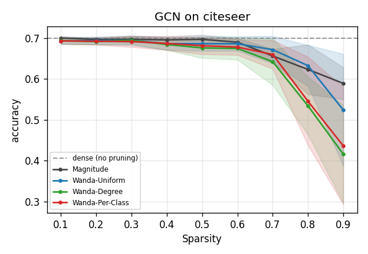

#### citeseer · GAT

*Metric: accuracy · dense baseline (0% sparsity): **0.627** · averaged over 3 runs*

| Sparsity | Magnitude | Wanda-Uniform | Wanda-Degree | Wanda-Per-Class |
|---|---|---|---|---|
| 0.1 | 0.628 | 0.636 | 0.637 | **0.637** |
| 0.2 | 0.625 | 0.635 | 0.635 | **0.635** |
| 0.3 | 0.625 | 0.632 | 0.632 | **0.632** |
| 0.4 | 0.626 | 0.632 | **0.633** | 0.631 |
| 0.5 | 0.628 | **0.634** | 0.632 | 0.633 |
| 0.6 | 0.627 | **0.633** | 0.630 | 0.630 |
| 0.7 | **0.627** | 0.624 | 0.626 | 0.626 |
| 0.8 | **0.628** | 0.626 | 0.620 | 0.623 |
| 0.9 | **0.618** | 0.591 | 0.588 | 0.578 |

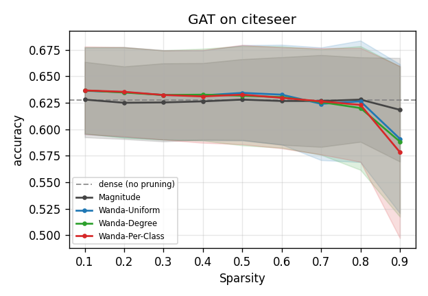

#### pubmed · GCN

*Metric: accuracy · dense baseline (0% sparsity): **0.785** · averaged over 3 runs*

| Sparsity | Magnitude | Wanda-Uniform | Wanda-Degree | Wanda-Per-Class |
|---|---|---|---|---|
| 0.1 | **0.784** | 0.783 | 0.783 | 0.783 |
| 0.2 | **0.783** | 0.781 | 0.781 | 0.780 |
| 0.3 | 0.781 | **0.782** | 0.774 | 0.781 |
| 0.4 | 0.777 | **0.784** | 0.762 | 0.782 |
| 0.5 | 0.775 | **0.782** | 0.735 | 0.777 |
| 0.6 | 0.747 | **0.776** | 0.714 | 0.764 |
| 0.7 | 0.733 | **0.740** | 0.664 | 0.736 |
| 0.8 | 0.701 | 0.707 | 0.605 | **0.719** |
| 0.9 | **0.721** | 0.659 | 0.505 | 0.664 |

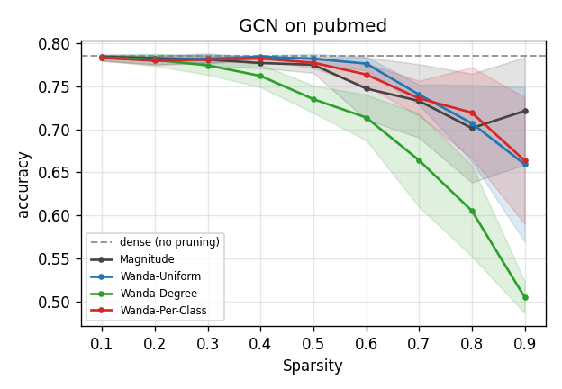

#### pubmed · GAT

*Metric: accuracy · dense baseline (0% sparsity): **0.765** · averaged over 3 runs*

| Sparsity | Magnitude | Wanda-Uniform | Wanda-Degree | Wanda-Per-Class |
|---|---|---|---|---|
| 0.1 | **0.765** | 0.761 | 0.761 | 0.761 |
| 0.2 | **0.765** | 0.761 | 0.761 | 0.761 |
| 0.3 | **0.766** | 0.761 | 0.760 | 0.762 |
| 0.4 | **0.764** | 0.760 | 0.756 | 0.759 |
| 0.5 | **0.763** | 0.756 | 0.749 | 0.759 |
| 0.6 | **0.761** | 0.751 | 0.734 | 0.750 |
| 0.7 | **0.756** | 0.743 | 0.713 | 0.738 |
| 0.8 | **0.752** | 0.707 | 0.642 | 0.703 |
| 0.9 | **0.725** | 0.586 | 0.452 | 0.598 |

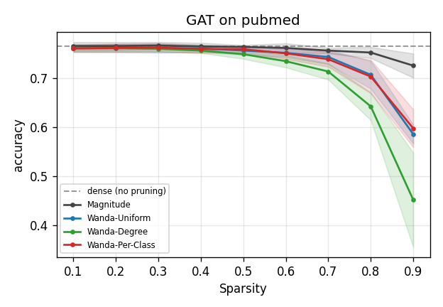

#### cs · GCN

*Metric: accuracy · dense baseline (0% sparsity): **0.941** · averaged over 3 runs*

| Sparsity | Magnitude | Wanda-Uniform | Wanda-Degree | Wanda-Per-Class |
|---|---|---|---|---|
| 0.1 | **0.941** | 0.941 | 0.941 | 0.941 |
| 0.2 | 0.941 | **0.941** | 0.941 | 0.941 |
| 0.3 | 0.939 | **0.940** | 0.940 | 0.940 |
| 0.4 | 0.938 | 0.939 | **0.940** | 0.939 |
| 0.5 | 0.932 | **0.938** | 0.937 | 0.937 |
| 0.6 | 0.916 | **0.934** | 0.933 | 0.927 |
| 0.7 | 0.849 | **0.914** | 0.905 | 0.899 |
| 0.8 | 0.574 | 0.864 | **0.878** | 0.819 |
| 0.9 | 0.278 | **0.674** | 0.664 | 0.598 |

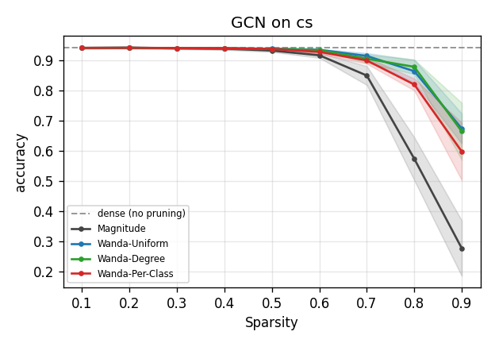

#### physics · GCN

*Metric: accuracy · dense baseline (0% sparsity): **0.967** · averaged over 3 runs*

| Sparsity | Magnitude | Wanda-Uniform | Wanda-Degree | Wanda-Per-Class |
|---|---|---|---|---|
| 0.1 | 0.967 | **0.967** | **0.967** | **0.967** |
| 0.2 | 0.967 | **0.967** | 0.967 | 0.967 |
| 0.3 | 0.967 | **0.967** | 0.967 | 0.967 |
| 0.4 | 0.966 | 0.967 | **0.967** | 0.967 |
| 0.5 | 0.964 | 0.967 | **0.967** | 0.967 |
| 0.6 | 0.964 | **0.967** | 0.966 | 0.967 |
| 0.7 | 0.961 | 0.965 | 0.961 | **0.965** |
| 0.8 | 0.953 | 0.960 | 0.940 | **0.963** |
| 0.9 | 0.816 | 0.910 | 0.891 | **0.940** |

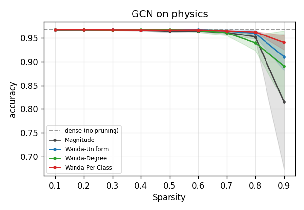

#### photo · GCN

*Metric: accuracy · dense baseline (0% sparsity): **0.941** · averaged over 3 runs*

| Sparsity | Magnitude | Wanda-Uniform | Wanda-Degree | Wanda-Per-Class |
|---|---|---|---|---|
| 0.1 | **0.941** | **0.941** | **0.941** | **0.941** |
| 0.2 | **0.941** | **0.941** | **0.941** | **0.941** |
| 0.3 | **0.941** | 0.941 | 0.941 | 0.941 |
| 0.4 | 0.940 | 0.941 | **0.941** | 0.941 |
| 0.5 | **0.942** | 0.941 | 0.941 | 0.941 |
| 0.6 | 0.939 | **0.941** | 0.940 | 0.940 |
| 0.7 | 0.937 | **0.940** | 0.940 | 0.940 |
| 0.8 | 0.938 | **0.938** | 0.938 | 0.938 |
| 0.9 | 0.932 | 0.930 | 0.930 | **0.932** |

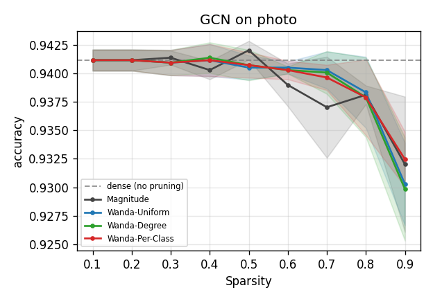

#### photo · GAT

*Metric: accuracy · dense baseline (0% sparsity): **0.926** · averaged over 3 runs*

| Sparsity | Magnitude | Wanda-Uniform | Wanda-Degree | Wanda-Per-Class |
|---|---|---|---|---|
| 0.1 | 0.925 | **0.926** | 0.926 | **0.926** |
| 0.2 | 0.925 | **0.926** | 0.925 | 0.925 |
| 0.3 | 0.924 | 0.925 | **0.926** | 0.926 |
| 0.4 | 0.921 | 0.923 | 0.923 | **0.924** |
| 0.5 | 0.913 | 0.916 | **0.917** | 0.914 |
| 0.6 | 0.897 | **0.901** | 0.898 | 0.896 |
| 0.7 | 0.830 | **0.862** | 0.857 | 0.827 |
| 0.8 | **0.777** | 0.742 | 0.703 | 0.677 |
| 0.9 | 0.532 | 0.488 | **0.564** | 0.495 |

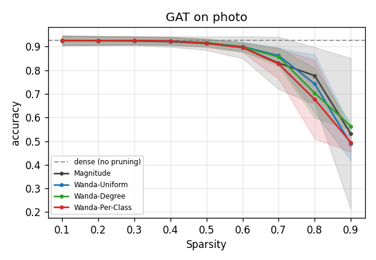

#### computers · GCN

*Metric: accuracy · dense baseline (0% sparsity): **0.904** · averaged over 3 runs*

| Sparsity | Magnitude | Wanda-Uniform | Wanda-Degree | Wanda-Per-Class |
|---|---|---|---|---|
| 0.1 | **0.904** | **0.904** | **0.904** | **0.904** |
| 0.2 | **0.904** | **0.904** | **0.904** | **0.904** |
| 0.3 | 0.904 | **0.904** | 0.904 | **0.904** |
| 0.4 | **0.905** | 0.904 | 0.904 | 0.904 |
| 0.5 | **0.904** | **0.904** | 0.904 | 0.904 |
| 0.6 | 0.904 | **0.904** | 0.903 | 0.903 |
| 0.7 | 0.904 | 0.903 | **0.904** | 0.904 |
| 0.8 | 0.899 | 0.901 | **0.902** | 0.901 |
| 0.9 | 0.719 | 0.878 | 0.873 | **0.886** |

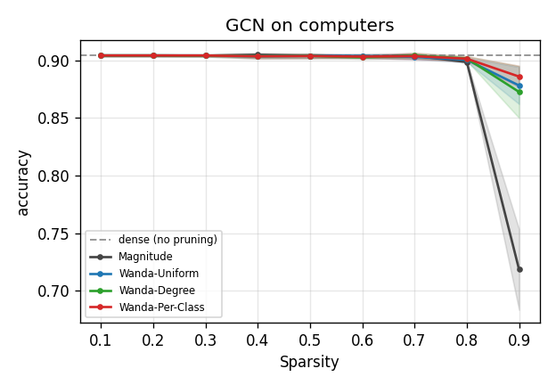

#### computers · GAT

*Metric: accuracy · dense baseline (0% sparsity): **0.906** · averaged over 3 runs*

| Sparsity | Magnitude | Wanda-Uniform | Wanda-Degree | Wanda-Per-Class |
|---|---|---|---|---|
| 0.1 | **0.906** | 0.906 | 0.906 | 0.906 |
| 0.2 | **0.907** | 0.905 | 0.906 | 0.906 |
| 0.3 | **0.908** | 0.908 | 0.907 | 0.907 |
| 0.4 | 0.904 | 0.904 | 0.904 | **0.905** |
| 0.5 | 0.895 | 0.902 | **0.903** | 0.902 |
| 0.6 | 0.854 | 0.885 | **0.889** | 0.883 |
| 0.7 | 0.709 | 0.815 | **0.836** | 0.802 |
| 0.8 | 0.495 | 0.622 | **0.710** | 0.578 |
| 0.9 | **0.589** | 0.237 | 0.259 | 0.235 |

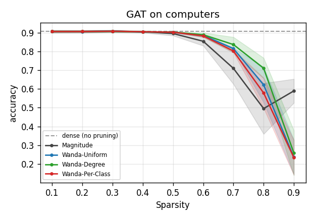

---

## 4. Homophilic — large-scale node classification

Reddit/Yelp/Arxiv/Flickr. Reddit (GCN/SAGE) and Yelp ran via the sparse-adjacency (SpMM) path. Baselines are healthy in rank terms (well above majority) but low in absolute terms vs literature — the 2-layer/100-epoch config is undertuned on these large graphs, and **Flickr is near-trivial** (+0.02 over majority), so treat Flickr as uninterpretable.

_Win counts here:_ Magnitude: **25**  ·  Wanda-Uniform: **9**  ·  Wanda-Degree: **4**  ·  Wanda-Per-Class: **4**  ·  _none-competitive: 3_  (of 45 cell×sparsity points)

#### ogbn-arxiv · GRAPHSAGE

*Metric: accuracy · dense baseline (0% sparsity): **0.549** · averaged over 1 run*

| Sparsity | Magnitude | Wanda-Uniform | Wanda-Degree | Wanda-Per-Class |
|---|---|---|---|---|
| 0.1 | **0.549** | **0.549** | **0.549** | **0.549** |
| 0.2 | **0.549** | **0.549** | **0.549** | **0.549** |
| 0.3 | **0.549** | **0.549** | **0.549** | **0.549** |
| 0.4 | **0.549** | 0.548 | 0.548 | 0.548 |
| 0.5 | **0.549** | 0.548 | 0.548 | 0.548 |
| 0.6 | **0.551** | 0.547 | 0.548 | 0.548 |
| 0.7 | **0.543** | 0.535 | 0.538 | 0.542 |
| 0.8 | 0.457 | 0.490 | 0.488 | **0.494** |
| 0.9 | 0.213 | 0.271 | **0.296** | 0.267 |

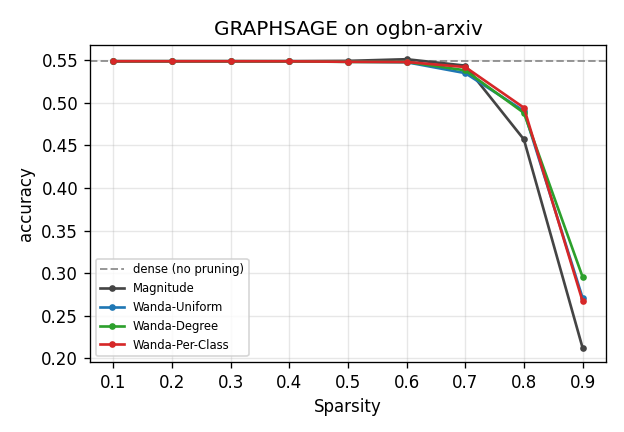

#### flickr · GRAPHSAGE

*Metric: accuracy · dense baseline (0% sparsity): **0.500** · averaged over 1 run*

| Sparsity | Magnitude | Wanda-Uniform | Wanda-Degree | Wanda-Per-Class |
|---|---|---|---|---|
| 0.1 | **0.500** | **0.500** | **0.500** | **0.500** |
| 0.2 | 0.499 | 0.500 | 0.500 | **0.500** |
| 0.3 | 0.499 | 0.500 | **0.500** | 0.500 |
| 0.4 | **0.500** | 0.499 | 0.499 | 0.500 |
| 0.5 | 0.498 | 0.499 | **0.499** | 0.499 |
| 0.6 | 0.497 | 0.498 | **0.499** | 0.499 |
| 0.7 | **0.500** | 0.498 | 0.498 | 0.497 |
| 0.8 | 0.460 | 0.485 | 0.485 | **0.488** |
| 0.9 | **0.466** | 0.441 | 0.443 | 0.444 |

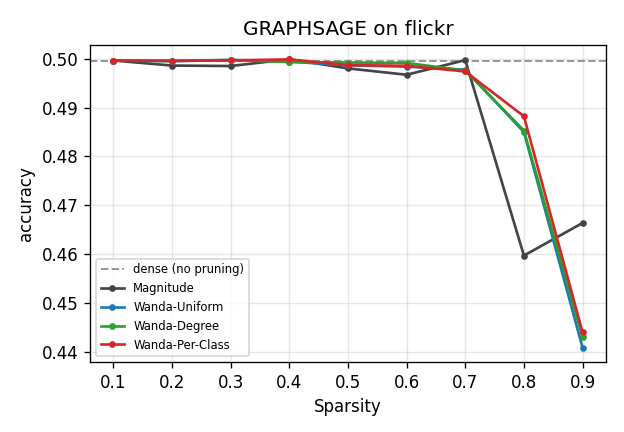

#### reddit · GCN

*Metric: accuracy · dense baseline (0% sparsity): **0.356** · averaged over 1 run*

| Sparsity | Magnitude | Wanda-Uniform | Wanda-Degree | Wanda-Per-Class |
|---|---|---|---|---|
| 0.1 | **0.356** | **0.356** | **0.356** | **0.356** |
| 0.2 | **0.356** | 0.356 | 0.356 | 0.356 |
| 0.3 | 0.350 | **0.356** | **0.356** | **0.356** |
| 0.4 | **0.359** | 0.356 | 0.356 | 0.356 |
| 0.5 | **0.362** | 0.356 | 0.356 | 0.356 |
| 0.6 | 0.352 | **0.356** | **0.356** | **0.356** |
| 0.7 | 0.347 | **0.356** | **0.356** | **0.356** |
| 0.8 | 0.342 | **0.356** | **0.356** | **0.356** |
| 0.9 | 0.223 | **0.355** | 0.355 | 0.355 |

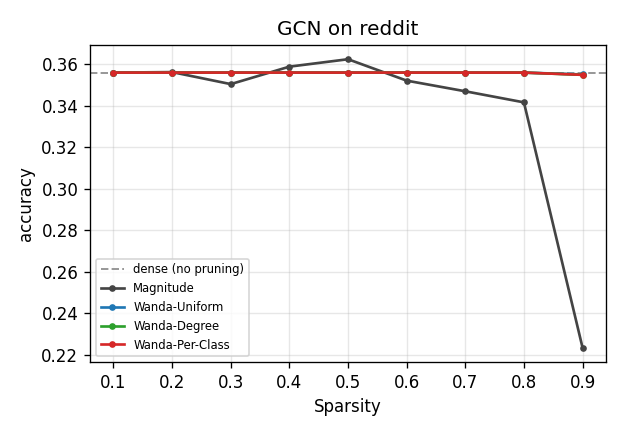

#### reddit · GRAPHSAGE

*Metric: accuracy · dense baseline (0% sparsity): **0.535** · averaged over 1 run*

| Sparsity | Magnitude | Wanda-Uniform | Wanda-Degree | Wanda-Per-Class |
|---|---|---|---|---|
| 0.1 | **0.535** | **0.535** | **0.535** | **0.535** |
| 0.2 | **0.535** | **0.535** | **0.535** | **0.535** |
| 0.3 | **0.535** | **0.535** | **0.535** | **0.535** |
| 0.4 | **0.535** | **0.535** | **0.535** | **0.535** |
| 0.5 | **0.535** | 0.535 | 0.535 | 0.535 |
| 0.6 | **0.535** | 0.535 | 0.535 | 0.535 |
| 0.7 | 0.535 | **0.535** | **0.535** | **0.535** |
| 0.8 | 0.534 | **0.535** | **0.535** | **0.535** |
| 0.9 | 0.501 | **0.535** | **0.535** | **0.535** |

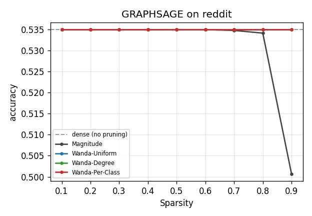

#### yelp · GRAPHSAGE

*Metric: micro-F1 · dense baseline (0% sparsity): **0.290** · averaged over 1 run*

| Sparsity | Magnitude | Wanda-Uniform | Wanda-Degree | Wanda-Per-Class |
|---|---|---|---|---|
| 0.1 | **0.290** | **0.290** | **0.290** | **0.290** |
| 0.2 | **0.290** | **0.290** | **0.290** | **0.290** |
| 0.3 | **0.290** | **0.290** | **0.290** | **0.290** |
| 0.4 | **0.290** | **0.290** | **0.290** | **0.290** |
| 0.5 | **0.290** | **0.290** | **0.290** | **0.290** |
| 0.6 | 0.290 | **0.290** | **0.290** | **0.290** |
| 0.7 | 0.290 | 0.290 | 0.290 | **0.290** |
| 0.8 | 0.290 | 0.290 | 0.290 | **0.290** |
| 0.9 | 0.208 | 0.286 | **0.287** | 0.285 |

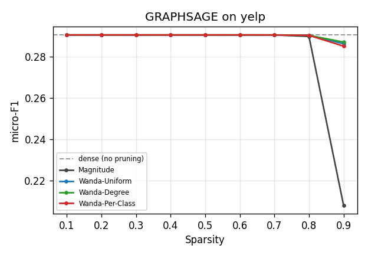

---

## 5. Graph classification

BBBP and PROTEINS (global-mean-pool readout). Single random 80/10/10 split.

_Win counts here:_ Magnitude: **13**  ·  Wanda-Uniform: **12**  ·  Wanda-Degree: **4**  ·  Wanda-Per-Class: **3**  ·  _none-competitive: 4_  (of 36 cell×sparsity points)

#### bbbp · GCN

*Metric: accuracy · dense baseline (0% sparsity): **0.776** · averaged over 3 runs*

| Sparsity | Magnitude | Wanda-Uniform | Wanda-Degree | Wanda-Per-Class |
|---|---|---|---|---|
| 0.1 | **0.779** | 0.776 | 0.776 | 0.776 |
| 0.2 | 0.771 | **0.776** | **0.776** | **0.776** |
| 0.3 | 0.767 | 0.777 | 0.777 | **0.779** |
| 0.4 | 0.772 | 0.777 | **0.779** | 0.777 |
| 0.5 | 0.750 | **0.780** | **0.780** | 0.779 |
| 0.6 | 0.748 | **0.782** | 0.771 | **0.782** |
| 0.7 | **0.748** | 0.517 | 0.449 | 0.512 |
| 0.8 | **0.748** | 0.459 | 0.457 | 0.459 |
| 0.9 | **0.748** | 0.410 | 0.397 | 0.393 |

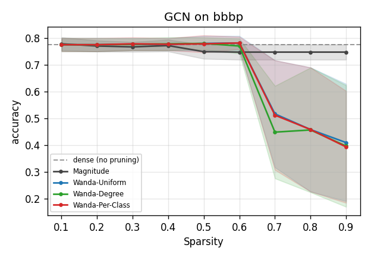

#### bbbp · GRAPHSAGE

*Metric: accuracy · dense baseline (0% sparsity): **0.779** · averaged over 3 runs*

| Sparsity | Magnitude | Wanda-Uniform | Wanda-Degree | Wanda-Per-Class |
|---|---|---|---|---|
| 0.1 | 0.776 | **0.779** | **0.779** | **0.779** |
| 0.2 | **0.785** | 0.784 | 0.784 | 0.784 |
| 0.3 | 0.774 | **0.787** | **0.787** | **0.787** |
| 0.4 | 0.769 | **0.789** | **0.789** | **0.789** |
| 0.5 | 0.748 | **0.774** | 0.766 | 0.772 |
| 0.6 | **0.748** | 0.655 | 0.693 | 0.655 |
| 0.7 | **0.748** | 0.467 | 0.338 | 0.468 |
| 0.8 | **0.748** | 0.592 | 0.558 | 0.585 |
| 0.9 | **0.689** | 0.558 | 0.564 | 0.558 |

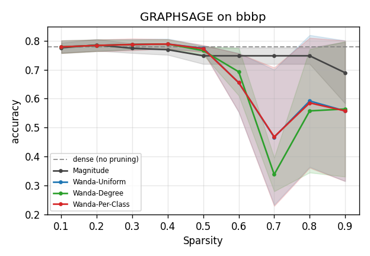

#### proteins · GCN

*Metric: accuracy · dense baseline (0% sparsity): **0.693** · averaged over 3 runs*

| Sparsity | Magnitude | Wanda-Uniform | Wanda-Degree | Wanda-Per-Class |
|---|---|---|---|---|
| 0.1 | **0.696** | 0.693 | 0.693 | 0.693 |
| 0.2 | **0.696** | **0.696** | **0.696** | 0.693 |
| 0.3 | **0.690** | **0.690** | **0.690** | **0.690** |
| 0.4 | 0.682 | **0.688** | **0.688** | **0.688** |
| 0.5 | 0.673 | **0.693** | **0.693** | **0.693** |
| 0.6 | 0.649 | **0.676** | 0.673 | 0.667 |
| 0.7 | 0.571 | **0.664** | 0.661 | **0.664** |
| 0.8 | 0.414 | 0.640 | 0.634 | **0.655** |
| 0.9 | 0.542 | **0.631** | 0.628 | 0.628 |

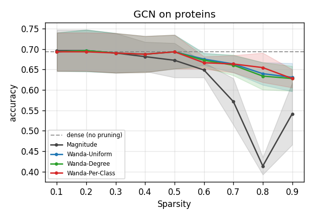

#### proteins · GRAPHSAGE

*Metric: accuracy · dense baseline (0% sparsity): **0.667** · averaged over 3 runs*

| Sparsity | Magnitude | Wanda-Uniform | Wanda-Degree | Wanda-Per-Class |
|---|---|---|---|---|
| 0.1 | **0.667** | **0.667** | **0.667** | **0.667** |
| 0.2 | 0.655 | **0.661** | **0.661** | **0.661** |
| 0.3 | 0.652 | 0.655 | **0.658** | 0.655 |
| 0.4 | 0.646 | **0.655** | **0.655** | **0.655** |
| 0.5 | **0.670** | 0.652 | 0.652 | 0.652 |
| 0.6 | 0.643 | 0.658 | 0.658 | **0.661** |
| 0.7 | 0.562 | 0.655 | 0.643 | **0.664** |
| 0.8 | 0.488 | 0.634 | **0.649** | 0.628 |
| 0.9 | 0.485 | **0.628** | 0.613 | **0.628** |

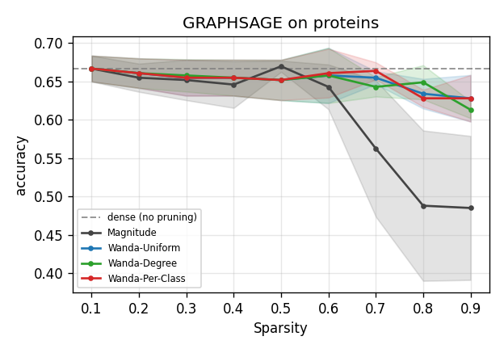
